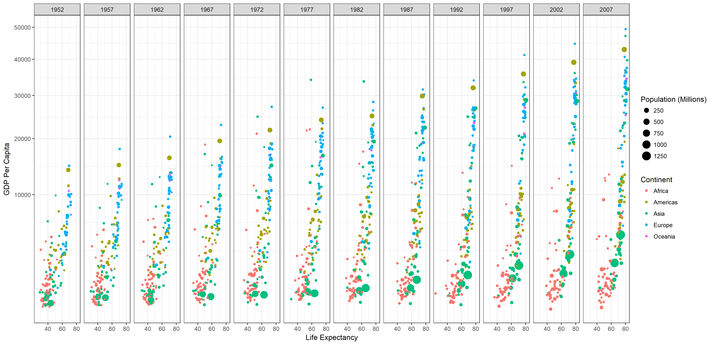

# Background

The Gapminder dataset was used by Hans Rosling in his 2006 [TED talk](https://www.ted.com/talks/hans_rosling_shows_the_best_stats_you_ve_ever_seen). I used it to recreate the plots below. Making animations will have to wait.

# Plots

