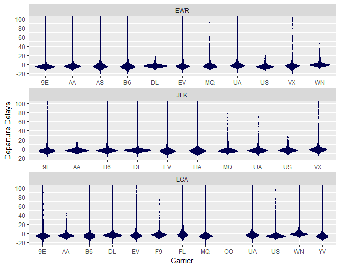
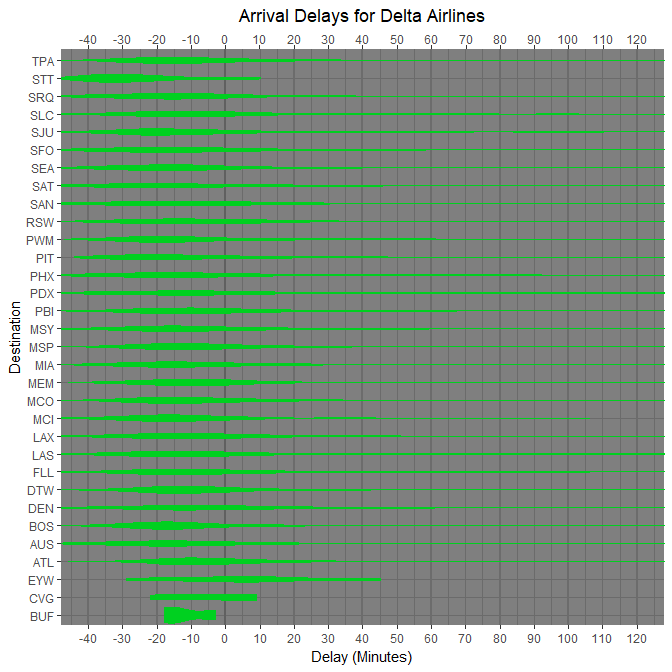

### Background

The NYCflights13::flights dataset contains all flights departing from NYC airports in 2013 (See R Documentation). </br>
In this analysis I address two questions: </br>

#### If one is leaving before noon, which two airlines would I recommend at each airport (JFK, LGA, EWR) that will have the lowest delay time at the 75th percentile?

Based on the 75th percentiles, for EWR, I reccommend Endeavor (9E) or US Airways (US); </br>
for JFK, I reccomend Delta (DL) or American Airlines (AA); </br>
and for LGA, US Airways or American Airlines.

This table shows the delays in minutes for each airline (carrier) at the 75th percentile. Negative values indicate that the plane arrived early.


<center>

```r
JFK_delay <- filter(flights, sched_dep_time < 1200 & origin == "JFK") %>%
  group_by(carrier) %>%
  summarise(JFK = quantile(dep_delay, probs = .75, na.rm = T))

LGA_delay <- filter(flights, sched_dep_time < 1200 & origin == "LGA") %>%
  group_by(carrier) %>%
  summarise(LGA = quantile(dep_delay, probs = .75, na.rm = T))
  
EWR_delay <- filter(flights, sched_dep_time < 1200 & origin == "EWR") %>%
  group_by(carrier) %>%
  summarise(EWR = quantile(dep_delay, probs = .75, na.rm = T))

delay <- suppressMessages(plyr::join(EWR_delay, JFK_delay, type = "right"))
delay <- suppressMessages(plyr::join(delay, LGA_delay,  type = "right"))
pander(delay)
```


---------------------------
 carrier   EWR   JFK   LGA 
--------- ----- ----- -----
   9E      -2     2     0  

   AA      -1     0    -1  

   B6      -1     1    -1  

   DL      -1    -1     0  

   EV       5     0     6  

   F9      NA    NA     0  

   FL      NA    NA     5  

   MQ       3    0.5    0  

   OO      NA    NA    67  

   UA       4     0     2  

   US      -2     1    -3  

   WN      NA    NA     5  

   YV      NA    NA    -1  
---------------------------
</center>

This plot show the distributions of delays for each carrier.


```r
filter(flights, sched_dep_time < 1200) %>%
  ggplot() +
  geom_violin(mapping = aes(carrier, dep_delay), fill = "#000050", color = "#000050") +
  facet_wrap( ~ origin, ncol = 1, scales = "free_x") +
  labs(x = "Carrier", y = "Departure Delays") +
  coord_cartesian(ylim = c(-20, 100)) +
  scale_y_continuous(breaks = seq(-20, 100, by = 20))
```

<!-- -->

</br>

#### Which destination airport is the worst airport for arrival time?

The two worst are Cincinnati Northern Kentucky (CVG) and Key West (EYW), based on the probability of arriving late:

<center>

```r
chance <- filter(flights, carrier == "DL" & dest != "JAC" & dest != "JAX" & dest != "PHL" & dest != "STL" & dest != "DCA" & dest != "OMA" & dest != "IND" & dest != "BNA") %>% 
  group_by(dest) %>%
  summarize(prob = mean(arr_delay > 2, na.rm = T))
#chance$`Probability of arriving later than 2 minutes` <- reorder(chance$`Probability of arriving later than 2 minutes`)
chance <- arrange(chance, prob)
colnames(chance) <- c("Destination", "Probability of arriving more than 2 minutes behind schedule")
pander(tail(chance, 10))
```


----------------------------------------------
 Destination    Probability of arriving more  
               than 2 minutes behind schedule 
------------- --------------------------------
     MIA                   0.3336             

     PIT                   0.3401             

     PDX                   0.3479             

     FLL                   0.3498             

     SAT                   0.3543             

     RSW                   0.3582             

     ATL                   0.3707             

     DEN                   0.3948             

     CVG                    0.5               

     EYW                   0.5294             
----------------------------------------------
</center>

Buffalo Niagara Intl (BUF) and Cyril E. King (STT) are the most likely destinations to arrive on time:

<center>

```r
pander(head(chance, 10))
```


----------------------------------------------
 Destination    Probability of arriving more  
               than 2 minutes behind schedule 
------------- --------------------------------
     BUF                     0                

     STT                  0.03448             

     MCI                   0.2125             

     SRQ                   0.2205             

     SEA                   0.2238             

     SJU                   0.2318             

     BOS                   0.2529             

     DTW                   0.2601             

     PHX                   0.2612             

     SFO                   0.2619             
----------------------------------------------
</center>


```r
filter(flights, carrier == "DL" & dest != "JAC" & dest != "JAX" & dest != "PHL" & dest != "STL" & dest != "DCA" & dest != "OMA" & dest != "IND" & dest != "BNA") %>%
  ggplot() +
    theme_dark() +
    geom_hline(yintercept = seq(-40, 120, by = 20), linetype = 1, color = "#6C6C6C", size = .75) +
    geom_hline(yintercept = 0, linetype = 1, color = "#606060", size = .75) +
    geom_violin(mapping = aes(fct_reorder(dest, arr_delay), arr_delay), color = "#00D020", fill = "#00D020") +
    scale_y_continuous(breaks = seq(-40, 120, by = 10), sec.axis = dup_axis(name = NULL)) +
    coord_flip(ylim = c(-40, 120)) +
    labs(y = "Delay (Minutes)", x = "Destination", title = "Arrival Delays for Delta Airlines") + 
  theme(plot.title = element_text(hjust = 0.5))
```

<!-- -->


</br>

#### Prominent quote from "What do people do with new data"

"@hmason Interview the source, if possible, to know all of the problems with the data, use limitations, caveats, etc. — Evan Thomas Paul (@evanthomaspaul) June 12, 2014"
