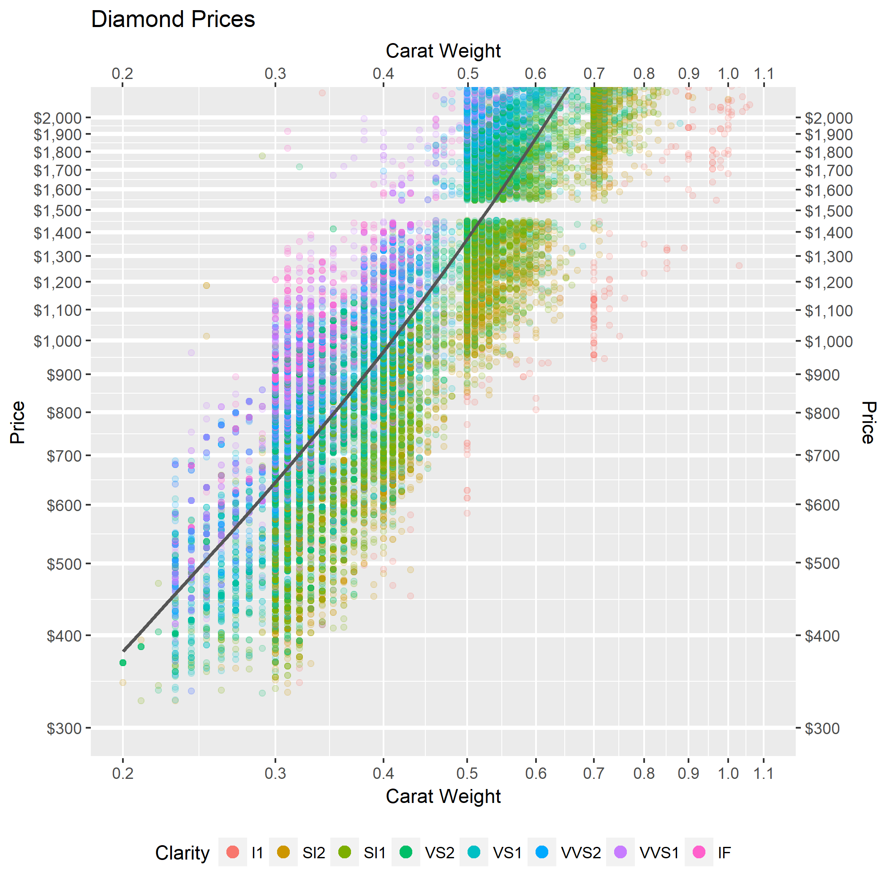

### Bad Graph:

```{r setup, include=FALSE}
library("tidyverse")
```

```{r, include=F, eval=F}
diamonds %>%
  ggplot() +
  geom_point(aes(x = carat, y = price, color = color, size = clarity, shape = cut))
ggsave("Case_Study_03/Class_Task_05/bad.png", width = 12, height = 12)
```


This graph combines each of the 4 features of diamonds. I represented them in almost the messiest way I could. The image is too big for the text.

</br>

### Better Graph:

```{r, include=F, eval=F}
diamonds %>%
  ggplot(aes(x = carat, y = price)) +
  #theme_dark() +
  geom_hline(yintercept = seq(0, 2000, by = 100), color = "white", size = 1.125) +
  geom_point(aes(color = clarity), alpha = 1/6) +
  #scale_color_gradient(low = "yellow", high = "magenta") +
  #guides(color = guide_legend(override.aes = list(alpha=1))) +
  geom_smooth(se = FALSE, color = "#555555", alpha = 0.3) +
  coord_cartesian(xlim = c(0.20, 1.1), ylim = c(300, 2000)) + 
  scale_x_log10(breaks = seq(0, 1.5, by = 0.1), sec.axis = dup_axis()) + 
  scale_y_log10(breaks = seq(200, 2000, by = 100), sec.axis = dup_axis(), labels = scales::dollar) + 
  theme(legend.position = "bottom") +
  guides(colour = guide_legend(nrow = 1, override.aes = list(size = 3, alpha = 1))) +
  labs(x = "Carat Weight", y = "Price", color = "Clarity", title = "Diamond Prices")
ggsave("Case_Study_03/Class_Task_05/better.png", width = 7, height = 7)
```


I chose to leave out color and cut. Color is about as significant in pricing as clarity, so a second graph for color would be worth observing. Cut doesn't affect price as significantly as the others.
I adjusted the scales to focus on his budget. I also stretched the axis scales logarithmically. I altered the transparency and made the legend a little bit neater. I also added thicker gridlines to identify $100 increments.