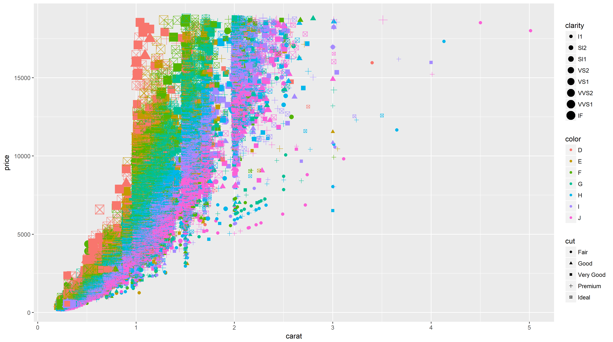
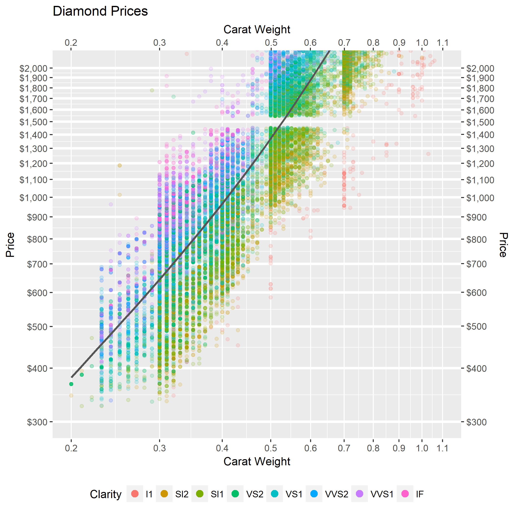

### Bad Graph:

This graph combines each of the 4 features of diamonds. I represented them in almost the messiest way I could. The image is too big for the text.

 

### Better Graph:

I chose to leave out color and cut. Color is about as significant in pricing as clarity, so a second graph for color would be worth observing. Cut doesn't affect price as significantly as the others.
I adjusted the scales to focus on his budget. I also stretched the axis scales logarithmically. I altered the transparency and made the legend a little bit neater. I also added thicker gridlines to identify $100 increments.
