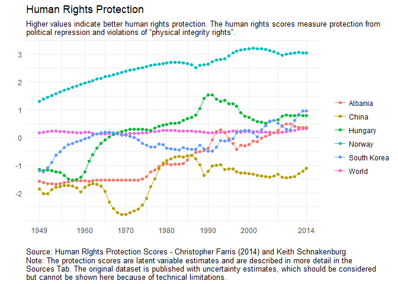

Recreating plot from https://ourworldindata.org/human-rights


```r
colnames(rights) <- c("country", "code", "year", "score")

world <- rights %>% 
  group_by(year) %>%
  mutate(avg = mean(score))
  

filter(rights, country == 'Norway' | country == 'China' | country == 'South Korea' | country == 'Hungary' | country == "Albania") %>%
  #group_by(country) %>%
  ggplot() +
  theme_minimal() +
  geom_point(data = world, mapping = aes(x = year, y = avg, color = "World")) +
  geom_line(data = world, mapping = aes(x = year, y = avg, color = "World")) +
  geom_point(mapping = aes(year, score, color = country)) +
  geom_line(mapping = aes(year, score, color = country)) +
  scale_y_continuous(breaks = seq(-2, 3, by = 1)) +
  scale_x_continuous(breaks = c(1949, seq(1960, 2000, by = 10), 2014)) +
  labs(title = "Human Rights Protection", x = "", y = "", subtitle = "Higher values indicate better human rights protection. The human rights scores measure protection from
political repression and violations of “physical integrity rights”.", 
caption = "Source: Human RIghts Protection Scores - Christopher Farris (2014) and Keith Schnakenburg
Note: The protection scores are latent variable estimates and are described in more detail in the
Sources Tab. The original dataset is published with uncertainty estimates, which should be considered
but cannot be shown here because of technical limitations.", color = "") +
  theme(plot.caption = element_text(hjust = 0.0))
```

<!-- -->
