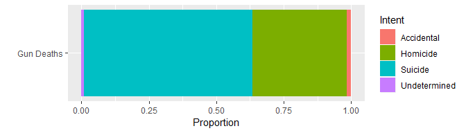

## Publication from FiveThirtyEight

#### https://fivethirtyeight.com/features/gun-deaths/

## My own graphics from this data


```r
filter(usa, intent != 'NA') %>% 
  ggplot(aes("Gun Deaths", fill = intent)) +
  geom_bar(position = "fill") +
  coord_flip() +
  labs(x = "", y = "Proportion", fill = "Intent")
```

<!-- -->

```r
filter(usa, intent != 'NA') %>% 
  ggplot(aes(race, fill = intent)) +
  geom_bar(position = "fill") +
  coord_flip() +
  labs(x = "", y = "Proportion", fill = "Intent")
```

<!-- -->


The article on 538 shows that the types of gun related deaths are varied. About two-thirds of gun deaths are suicides. The types of deaths we usually talk about are the police and mass shootings, but they make up a smaller part of the homicides. The purpose of the article was to show that the diversity of these causes should not be ignored.

## Investigating Time of Year


```r
usa %>% 
  ggplot(aes(month, fill = as.factor(year))) +
  geom_bar() +
  facet_wrap( ~ year, nrow = 1) +
  theme(legend.position = "none") +
  labs(title = "Number of Gun Deaths", fill = "Year", y = "", x = "Month")
```

<!-- -->
</br>February has the least gun deaths and this is due to more than it being a shorter month.

I'll break this up by cause of death.

```r
filter(usa, intent != "NA" & intent != "Undetermined") %>% 
  ggplot(aes(month, fill = education)) +
  geom_bar() +
  labs(fill = "Level of Education", x = "Month", y = "") +
  facet_wrap( ~ intent, nrow = 1, scales = "free") +
  theme(legend.position = "bottom") +
  scale_x_discrete(position = "top")
```

<!-- -->
</br>Accidental gun deaths seem to reflect holiday and vacation times. Much fewer homicides occur in Febraury and the most occur in the Summer and in December. Less suicides occur in November, December, and February.

You are less likely to be shot by the police in February too.

```r
filter(usa, as.factor(police) == 1) %>% 
  ggplot(aes(month)) +
  geom_bar() +
  labs(title = "Killings by Police")
```

<!-- -->

It could be that the fewer deaths in February are a result of people being distracted by Valentines Day. This especially makes sense for homicides as shooting isn't very romantic.

My suggestion is that during the summer we emphasize that people spend time with their families and significant others.


## Note from Effectively Communicating Numbers

Visuals are good for seeing the shape of data. If acuracy is needed light gridlines can be added, but soon a table would be better consulted. I spent a while studying colorblindness. The advice to avoid bright colors unless sommething really needs to stand out is important for someone like me who likes to be a little exotic. This palette has brighter colors than should normally be used, but I created it as an experiment that works for as many forms of color vision as possible, including monochromacy for black and white printing:


</br>

</br>

</br>

</br>

</br>

</br>

</br>

</br>


It needs a little more work, yet is already on a pretty fragile balance. Monocromacy is the hardest to maintain while keeping the others. I have concluded that it would be better to follow [this](http://thestarman.pcministry.com/RGB/RGBIntensity.htm) kind of scale and then if I really wanted, check my graphics with [this](https://www.youtube.com/watch?v=dQw4w9WgXcQ)[.](http://www.color-blindness.com/coblis-color-blindness-simulator/)


