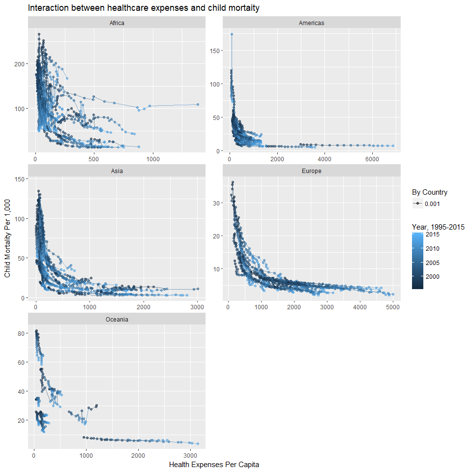

```r
#, fig.width = 10, fig.height = 15
filter(heal, year > 1995 & continent != 'NA') %>%
  group_by(country) %>% 
  ggplot() +
  geom_point(mapping = aes(health_exp_total, child_mort, color = year, alpha = 0.001)) +
  labs(title = "Interaction between healthcare expenses and child mortaity", y = "Child Mortality Per 1,000", x = "Health Expenses Per Capita", size = "Country Population in Millions", color = "Year, 1995-2015", alpha = "By Country") +
  geom_line(mapping = aes(health_exp_total, child_mort, group = country, color = year, alpha = 0.001)) +
  #coord_cartesian( , c(0,250)) +
  facet_wrap( ~ continent, ncol = 2, scales = 'free')
```

```
## Warning: Removed 864 rows containing missing values (geom_point).
```

```
## Warning: Removed 379 rows containing missing values (geom_path).
```

<!-- -->


