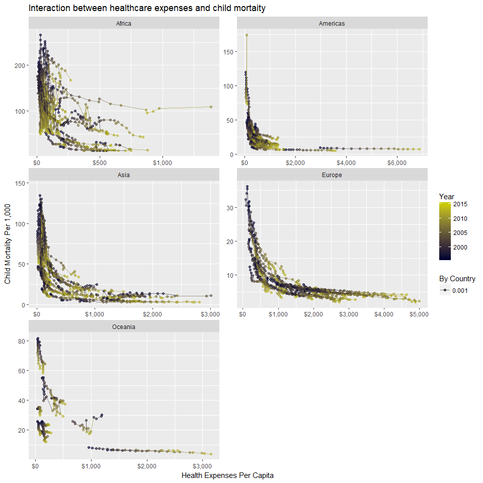
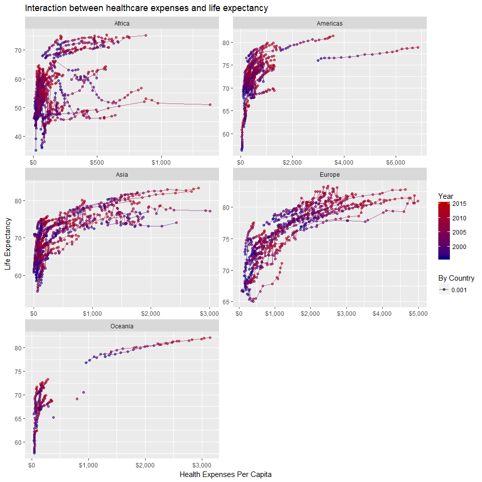

```r
filter(heal, year > 1995 & continent != 'NA') %>%
  group_by(country) %>% 
  ggplot() +
  geom_point(mapping = aes(health_exp_total, child_mort, color = year, alpha = 0.001)) +
  labs(title = "Interaction between healthcare expenses and child mortaity", y = "Child Mortality Per 1,000", x = "Health Expenses Per Capita", size = "Country Population in Millions", color = "Year, 1995-2015", alpha = "By Country") +
  geom_line(mapping = aes(health_exp_total, child_mort, group = country, color = year, alpha = 0.001)) +
  #coord_cartesian( , c(0,250)) +
  facet_wrap( ~ continent, ncol = 2, scales = "free") +
  scale_color_gradient("Year", low = "#000033", high = "#cccB00") +
  scale_x_continuous(labels = scales::dollar)
```

<!-- -->


```r
filter(heal, year > 1995 & continent != 'NA') %>%
  group_by(country) %>% 
  ggplot() +
  geom_point(mapping = aes(health_exp_total, life_expectancy, color = year, alpha = 0.001)) +
  labs(title = "Interaction between healthcare expenses and life expectancy", y = "Life Expectancy", x = "Health Expenses Per Capita", size = "Country Population in Millions", color = "Year, 1995-2015", alpha = "By Country") +
  geom_line(mapping = aes(health_exp_total, life_expectancy, group = country, color = year, alpha = 0.001)) +
  #coord_cartesian( , c(0,250)) +
  facet_wrap( ~ continent, ncol = 2, scales = "free") +
  scale_color_gradient("Year", low = "#000088", high = "#bb0000") +
  scale_x_continuous(labels = scales::dollar)
```

<!-- -->


```r
filter(heal, year > 1995 & continent != 'NA') %>%
  group_by(country) %>% 
  ggplot(aes(health_exp_total, child_mort)) +
  geom_point(aes( alpha = 0.001, color = country), show.legend = FALSE) +
  labs(title = "Interaction between healthcare expenses and child mortaity", y = "Child Mortality Per 1,000", x = "Health Expenses Per Capita", size = "Country Population in Millions", color = "Year, 1995-2015", alpha = "By Country") +
  geom_smooth() +
  scale_y_continuous(trans = "sqrt") +
  facet_wrap( ~ continent, ncol = 1, scales = 'free') +
  theme(legend.direction = 'horizontal') +
  theme(legend.text = element_text(angle = 60)) +
  theme(legend.position = c(0.73, 0.13)) 
```


