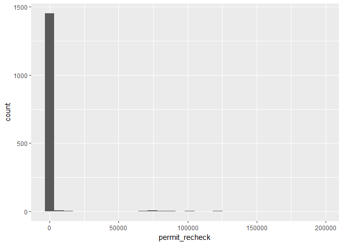
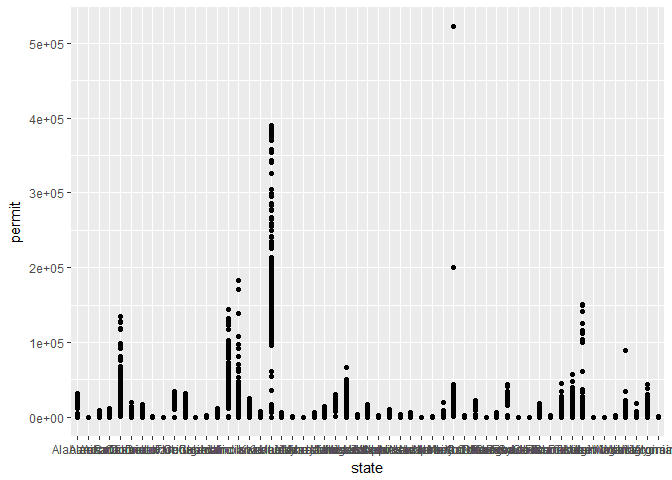
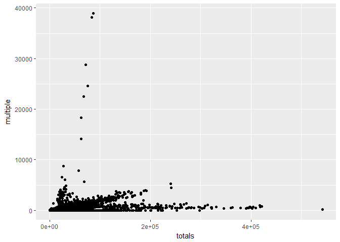
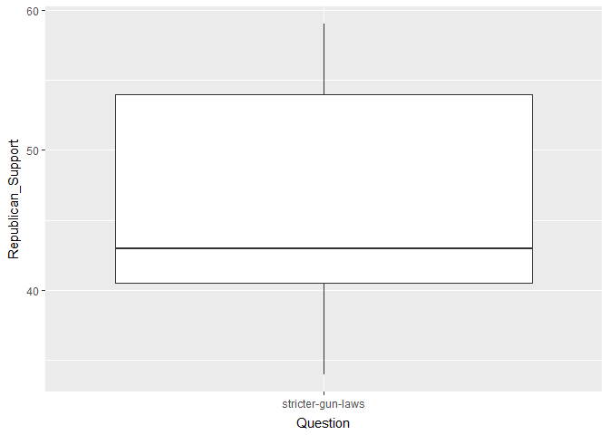
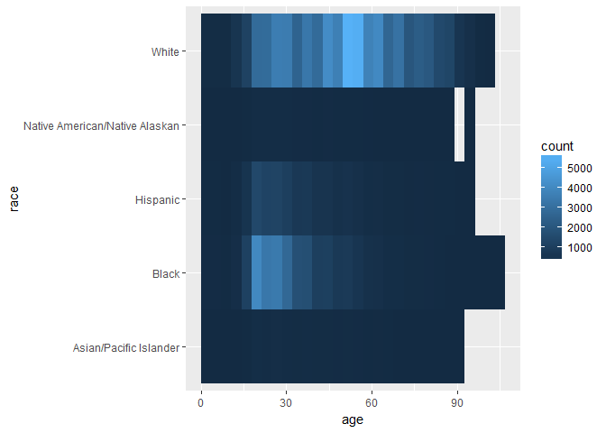
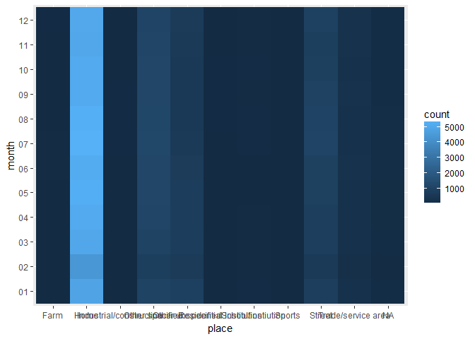
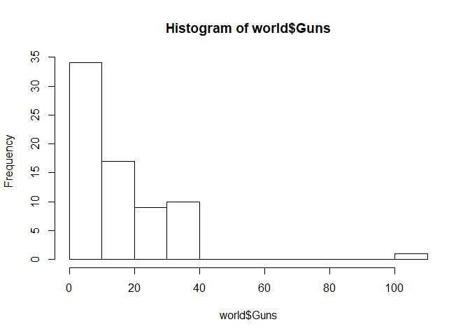
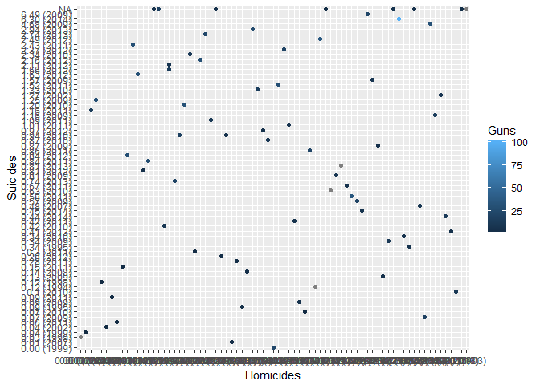
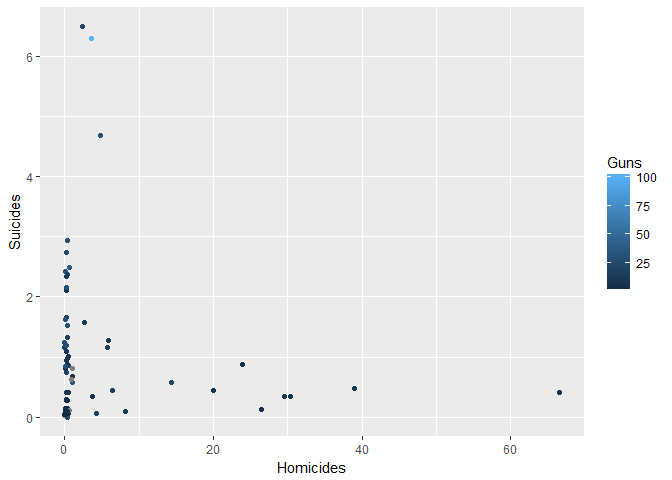

<hr>


# {.tabset .tabset-fade}

## NICS Background Checks

#### Link: [BuzzFeed, NICS Background Checks](https://github.com/BuzzFeedNews/nics-firearm-background-checks)

Information on background checks with firearm purchases through NICS.</br>
This data set has limitations including that it is only the purchases through NICS and that the laws vary from one state to the other. It might still be useful because it includes details about the types of weapons purchased. I will want to split the date column into a month and a year column.

</br>

#### Using the data

I learned from Dallin that a quick way to read in a data frame from the internet is by putting the url to the raw file in the read_csv() function:</br>
nics <- read_csv("https://raw.githubusercontent.com/BuzzFeedNews/nics-firearm-background-checks/master/data/nics-firearm-background-checks.csv")

I want to create month and year columns:</br>

nics <- mutate(nics, date = month) # preserve the old column as 'date'</br>
nics <- nics %>% </br>
&nbsp;&nbsp;&nbsp;&nbsp;  separate(month, c("month", "year"), "-") # split month into two columns


```r
nics %>% 
  ggplot(aes(permit_recheck)) +
  geom_histogram()
```

```
## `stat_bin()` using `bins = 30`. Pick better value with `binwidth`.
```

```
## Warning: Removed 11385 rows containing non-finite values (stat_bin).
```

<!-- -->
It would help to know what permit_recheck means.


```r
nics %>%
  group_by(state) %>% 
  ggplot(mapping = aes(state, permit)) +
  geom_point()
```

```
## Warning: Removed 24 rows containing missing values (geom_point).
```

<!-- -->

```r
nics %>%
  ggplot(mapping = aes(totals, multiple)) +
  geom_point()
```

<!-- -->

</br>

## Guns Poll Quiz

#### Link: [FiveThirtyEight, Guns Poll Quiz](https://github.com/fivethirtyeight/data/tree/master/poll-quiz-guns)

This is an opinion poll that took place February-March 2018.</br>
It has a nice variety of questions and can provide useful background information. I don't particularly like polls however, because they are unlikely correctly represent the population. I wouldn't rely on the data for an analysis.

#### Using the data

poll <- read_csv("https://raw.githubusercontent.com/fivethirtyeight/data/master/poll-quiz-guns/guns-polls.csv")

This removes the spaces from column names:</br>
names(poll) <- gsub(\" \", \"_\", names(poll))


```r
poll %>% 
  ggplot(mapping = aes(Question, Support)) +
  geom_boxplot()
```

<!-- -->

```r
filter(poll, Question == "stricter-gun-laws") %>% 
  ggplot(mapping = aes(Question, Republican_Support)) +
  geom_boxplot()
```

<!-- -->

</br>

## 538's Report on Gun Deaths

#### Link: [data.world, 538's Report on Gun Deaths](https://data.world/azel/gun-deaths-in-america)

The details about race and age will be helpful because a part of the motivation of my project is to determine what firearm laws are recommendable. There is also a column indicating the location of the incident (home, street, etc.). These details would prompt me to put in other data sets so that I can compare for example, the proportion of people in the US with bachelor's degrees.
This is the same data set that is used in Case Study 4, but I found it on my own. The source includes a lot of useful R scripts examples.

#### Using the Data

usa <- read_csv("full_data.csv")


```r
usa %>% 
  ggplot(aes(age, race)) +
  geom_bin2d()
```

```
## Warning: Removed 18 rows containing non-finite values (stat_bin2d).
```

<!-- -->

```r
usa %>% 
  ggplot(aes(place, month)) +
  geom_bin2d() 
```

<!-- -->


## List of Countries by Firearm-Related Death Rate

#### Link: [Wikipedia, List of Countries by Firearm-Related Death Rate](https://en.wikipedia.org/wiki/List_of_countries_by_firearm-related_death_rate)

Summaries pulled from Gunpolicy.org</br>
This one is really useful. It includes gun related death rates along with the number of guns people own which is exactly the kind of thing I am looking for.</br>
I found it through this project: https://data.world/pshaff/gun-ownership

#### Using the Data

world <- read_csv("gun_deaths.csv")

I get this warning:</br>
"Missing column names filled in: 'X1' [1]"</br>
Because the first column was the row label.</br>
Using colnames(world)[1] <- "Country" renames it.</br>


```r
hist(world$Guns)
```

<!-- -->
</br>The 100% is the United States.

```r
world %>% 
  ggplot(aes(Homicides, Suicides, color = Guns)) +
  geom_point()
```

<!-- -->
</br>There's a problem here.</br>
The data is entered in this format 'number (year)'

How I fixed this:</br>
world <- %>% </br>
&nbsp;&nbsp;&nbsp;&nbsp; separate(Homicides, c("Homicides", "H_Source"), " ") %>% </br>
&nbsp;&nbsp;&nbsp;&nbsp; separate(Suicides, c("Suicides", "S_Source"), " ") %>% </br>
&nbsp;&nbsp;&nbsp;&nbsp; separate(Unintentional, c("Unintentional", "U_Source"), " ") %>% </br>
&nbsp;&nbsp;&nbsp;&nbsp; separate(Intentional, c("Intentional", "I_Source"), " ")</br>
world\$Homicides <- as.numeric(world\$Homicides)</br>
world\$Suicides <- as.numeric(world\$Suicides)</br>
world\$Unintentional <- as.numeric(world\$Unintentional)</br>
world\$Intentional <- as.numeric(world\$Intentional)
  


```r
world %>% 
  ggplot(aes(Homicides, Suicides, color = Guns)) +
  geom_point()
```

```
## Warning: Removed 8 rows containing missing values (geom_point).
```

<!-- -->
