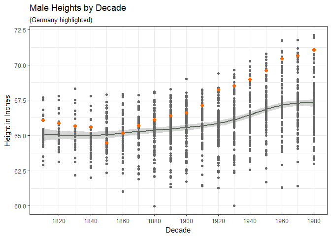
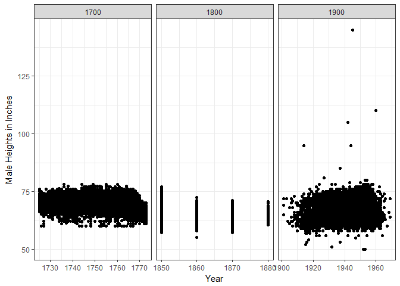

We claim that humans are getting taller. Is this true?


```r
tempy <- tempfile("wld", tmpdir = tempdir(), "xlsx")
download("https://byuistats.github.io/M335/data/heights/Height.xlsx", tempy, mode = "wb")
# Worldwide estimates
wld <- read_xlsx(tempy, skip = 2) %>% 
  gather(key = "year", value = "height_cm", '1800':'2011', na.rm = T) %>%
  type_convert(col_types = cols(year = col_integer())) %>% 
  mutate(year_decade = year %/% 10 * 10) %>% 
  separate(year, into = c("century", "decade"), sep = 2) %>% 
  separate(decade, c("decade", "year"), sep = 1) %>% 
  mutate(height_in = height_cm * 0.39370)
colnames(wld)[1:2] <- c("code","country")
```


```r
# see http://www.uni-tuebingen.de/fakultaeten/wirtschafts-und-sozialwissenschaftliche-fakultaet/faecher/wirtschaftswissenschaft/lehrstuehle/volkswirtschaftslehre/wirtschaftsgeschichte/data-hub-height.html

# German conscripts in Bavaria, 
ger <- read_dta("https://byuistats.github.io/M335/data/heights/germanconscr.dta") %>% 
  transmute(birth_year = bdec, height_in = height * 0.3937008, height_cm = height, study_id = as.character(c(1001:2382)))

# Bavarian conscripts
bav <- read_dta("https://byuistats.github.io/M335/data/heights/germanprison.dta") %>% 
  transmute(birth_year = bdec, height_in = height * 0.3937008, height_cm = height, study_id = as.character(c(3001:3477)))


# soldiers, see b6090.rtf
sol <- as_tibble(read.dbf("C:\\Users\\Jim\\Desktop\\Math 335\\M335_Greene_Jim_\\Case_Study_05\\B6090.DBF")) %>% 
  mutate(height_in = (F * 12) + Z + ((V + (S / 3)) / 4) ) %>% 
  transmute(birth_year = GEBJ, height_in = height_in, height_cm = CMETER, study_id = as.character(RECNO))


# BLS wage and height
bls <- read_csv("https://github.com/hadley/r4ds/raw/master/data/heights.csv") %>% 
  transmute(birth_year = 1850, height_in = height, height_cm = height * 0.39370, study_id = as.character(c(50001:51192)))


# wis <- read_sav("Case_Study_05/wisconsin.sav") only works in haven 1.1.0

# see https://www.ssc.wisc.edu/nsfh/wave3/NSFH3%20Apr%202005%20release/Nsfh3main04202005.CBK
wis <- as_tibble(read.spss("http://www.ssc.wisc.edu/nsfh/wave3/NSFH3%20Apr%202005%20release/main05022005.sav", to.data.frame = T)) %>% 
  filter(RT216I >= 0 & RT216F >= 0) %>% 
  transmute(birth_year = 1900 + as.numeric(DOBY), height_in = RT216I + (RT216F * 12), height_cm = (RT216I + (RT216F * 12)) * 0.39370, study_id = as.character(CASEID))
```


```r
all <- ger %>% 
  bind_rows(bav) %>% 
  bind_rows(sol) %>% 
  bind_rows(bls) %>% 
  bind_rows(wis)
```


```r
write_csv(wld, "Case_Study_05/World_Male_Heights")
write_csv(all, "Case_Study_05/World_Male_Heights_2")
```


```r
wld %>% 
  ggplot(mapping = aes(x = year_decade, y = height_in)) +
  theme_bw() +
  geom_smooth(color = "#556655") +
  geom_point(data = filter(wld, country != "Germany"), color = "#666666") +
  geom_point(data = filter(wld, country == "Germany"), color = "#FF6600", size = 2) +
  scale_x_continuous(breaks = seq(1800, 2010, by = 20)) +
  labs(title = "Male Heights by Decade", subtitle = "(Germany highlighted)", x = "Decade", y = "Height in Inches")
```

<!-- -->
</br>
The World data set shows that people were getting taller from 1860 to 1980. It can be seen from this plot that during that time the Germans became some of the tallest people.


```r
filter(all, birth_year != "NA") %>% 
  ggplot(aes(birth_year, height_in)) +
  theme_bw() +
  geom_point() +
  facet_grid( ~ (birth_year%/%100 * 100), scales = "free_x") +
  labs(x = "Year", y = "Male Heights in Inches")
```

<!-- -->
</br>
In this plot, all of the ones from the 18th century are from the Bavarian and Palatinate soldiers dataset. Also, the only ones in the 20th century come from the Wisconsin data set. For these reasons, the data may not acurately represent the historical heights for the world.

Just going off of this plot, the three centuries aren't much different from each other.
