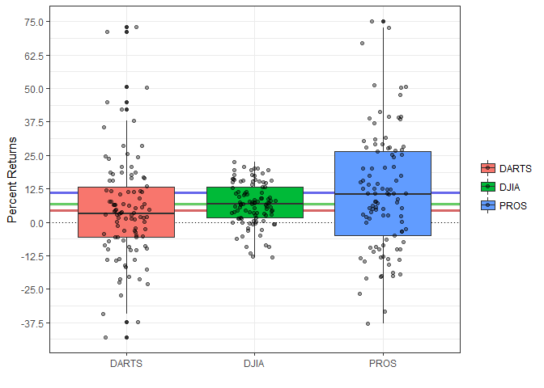

```r
dart_rds <- read_rds(gzcon(url("https://github.com/byuistats/data/blob/master/Dart_Expert_Dow_6month_anova/Dart_Expert_Dow_6month_anova.RDS?raw=true")))
# dart_temp <- tempfile(pattern = "dart", tmpdir = tempdir(), fileext = "rds")
# write_rds(cart_rds, dart_temp)
# dart_rds <- read_rds(dart_temp)

dart_temp <- tempfile(pattern = "dart", tmpdir = tempdir(), fileext = "xlsx")
download("https://github.com/byuistats/data/blob/master/Dart_Expert_Dow_6month_anova/Dart_Expert_Dow_6month_anova.xlsx?raw=true", dart_temp, mode = "wb")
dart_xlsx <- read_xlsx(dart_temp)

dart_csv <- read_csv("https://raw.githubusercontent.com/byuistats/data/master/Dart_Expert_Dow_6month_anova/Dart_Expert_Dow_6month_anova.csv")
```

```
## Parsed with column specification:
## cols(
##   contest_period = col_character(),
##   variable = col_character(),
##   value = col_double()
## )
```

```r
dart_dta <- read_dta("https://github.com/byuistats/data/blob/master/Dart_Expert_Dow_6month_anova/Dart_Expert_Dow_6month_anova.dta?raw=true")

dart_sav <- read_sav("https://github.com/byuistats/data/blob/master/Dart_Expert_Dow_6month_anova/Dart_Expert_Dow_6month_anova.sav?raw=true")
```


```r
all.equal(dart_rds, dart_xlsx)
```

```
## [1] "Attributes: < Component \"class\": Lengths (1, 3) differ (string compare on first 1) >"
## [2] "Attributes: < Component \"class\": 1 string mismatch >"
```

```r
all.equal(dart_xlsx, dart_csv)
```

```
## [1] TRUE
```

```r
all.equal(dart_csv, dart_dta)
```

```
## [1] TRUE
```

```r
all.equal(dart_dta, dart_sav)
```

```
## [1] TRUE
```


```r
dart_sav %>% 
  ggplot(aes(variable, value, fill = variable)) +
  theme_bw() +
  geom_hline(yintercept = 0, linetype = 3) +
  geom_hline(yintercept = mean(filter(dart_sav, variable == "DARTS")$value), color = "#bb0000", size = 1.125, alpha = 0.6) +
  geom_hline(yintercept = mean(filter(dart_sav, variable == "DJIA")$value), color = "#00aa00", size = 1.125, alpha = 0.6) +
  geom_hline(yintercept = mean(filter(dart_sav, variable == "PROS")$value), color = "#0000dd", size = 1.125, alpha = 0.6) +
  geom_boxplot() +
  geom_jitter(alpha = 0.4, width = 0.18) +
  scale_y_continuous(breaks = seq(-37.5, 75, by = 12.5)) +
  labs(x = "", y = "Percent Returns", fill = "", alpha = "")
```

<!-- -->


