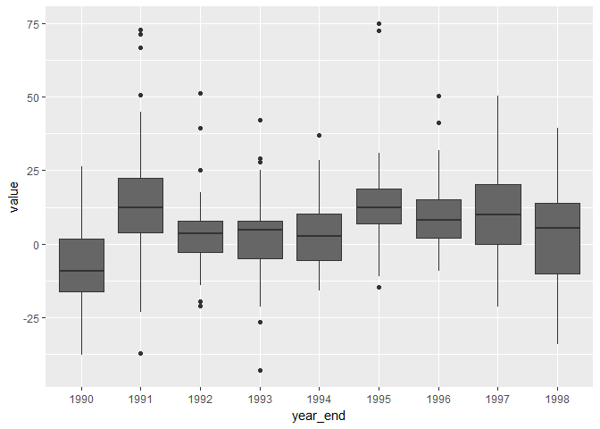

### Data Wrangling


</br>

Tidying the data

```r
dart <- filter(dart, contest_period != "Average") %>%
  separate(contest_period, into = c("junk", "period"), sep = "-") %>%
  select(-junk) %>% 
  separate(period, c("month_end", "year_end"), sep = -4) %>% 
  write_rds("darts.rds")

read_rds("darts.rds")
```

```
## # A tibble: 300 x 4
##    month_end year_end variable  value
##    <chr>     <chr>    <chr>     <dbl>
##  1 June      1990     PROS      12.7 
##  2 July      1990     PROS      26.4 
##  3 August    1990     PROS       2.50
##  4 September 1990     PROS     -20.0 
##  5 October   1990     PROS     -37.8 
##  6 November  1990     PROS     -33.3 
##  7 December  1990     PROS     -10.2 
##  8 January   1991     PROS     -20.3 
##  9 February  1991     PROS      38.9 
## 10 March     1991     PROS      20.2 
## # ... with 290 more rows
```
</br>There was an "Average" entry for contest_period for each variable (DARTS, DJIA, PROS). There is no useful place for those rows so I removed them. All the other rows have a hyphen before the usefull information, which made things easier.


</br>

Plotting by year

```r
dart %>% 
  ggplot(aes(year_end, value)) +
  geom_boxplot(fill = "#666666")
```

<!-- -->
</br>This is a simple boxplot to show the returns by year. I didn't try to add more information than needed.

</br>

Showing a table of returns for DJIA

```r
dart$month_end <- gsub("Dec.", "December", dart$month_end)
dart$month_end <- gsub("Decembermber", "December", dart$month_end)
dart$month_end <- gsub("Febuary", "February", dart$month_end)
dart$month_end <- factor(dart$month_end, levels = month.name)

filter(dart, variable == "DJIA") %>% 
  spread(key = year_end, value = value) %>% 
  select(-variable)# %>% 
```

```
## # A tibble: 12 x 10
##    month_end `1990`  `1991`  `1992` `1993`  `1994` `1995` `1996`  `1997`
##    <fct>      <dbl>   <dbl>   <dbl>  <dbl>   <dbl>  <dbl>  <dbl>   <dbl>
##  1 January    NA     -0.800   6.50  -0.800  11.2     1.80 15.0    19.6  
##  2 February   NA     11.0     8.60   2.50    5.50    3.20 15.6    20.1  
##  3 March      NA     15.8     7.20   9.00    1.60    7.30 18.4     9.60 
##  4 April      NA     16.2    10.6    5.80    0.500  12.8  14.8    15.3  
##  5 May        NA     17.3    17.6    6.70    1.30   19.5   9.00   13.3  
##  6 June        2.50  17.7     3.60   7.70   -6.20   16.0  10.2    16.2  
##  7 July       11.5    7.60    4.20   3.70   -5.30   19.6   1.30   20.8  
##  8 August     -2.30   4.40   -0.300  7.30    1.50   15.3   0.600   8.30 
##  9 September  -9.20   3.40   -0.100  5.20    4.40   14.0   5.80   20.2  
## 10 October    -8.50   4.40   -5.00   5.70    6.90    8.20  7.20    3.00 
## 11 November  -12.8   -3.30   -2.80   4.90   -0.300  13.1  15.1     3.80 
## 12 December   -9.30   6.60    0.200  8.00    3.60    9.30 15.5    -0.700
## # ... with 1 more variable: `1998` <dbl>
```

```r
  #pander() #Pander does not display well in md files
```
This is a nice way to prepare the data for a human to view. February and December appear with various spellings, so I needed to fix them. There must be a more elegant way to do so. I also rearranged the months.

</br>

When experimenting with spread I discovered that tidyr::spread has a problem with duplicate values because it tries to condense rows as much as possible. One work around is group_by(column_with_duplicates) %>% do(tibble::rowid_to_column(.)) %>% .
