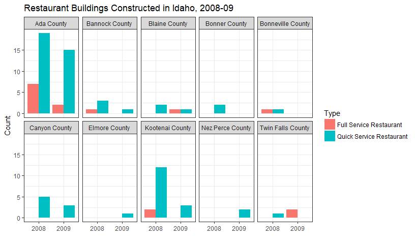

```r
# Preparar

library(tidyverse)
library(stringr)
library(buildings)
library(ggridges)
library(DT)

not_restaurants <- str_trim(str_to_lower(c("development","Food preperation center", "Food Services center","bakery","Grocery","conceession","Cafeteria", "lunchroom","school","facility"," hall ")))
standalone_retail <- str_trim(str_to_lower(c("Wine","Spirits","Liquor","Convenience","drugstore","Flying J", "Rite Aid ","walgreens ","Love's Travel ")))
full_service_type <- str_trim(str_to_lower(c("Ristorante","mexican","pizza ","steakhouse"," grill ","buffet","tavern"," bar ","waffle","italian","steak house")))
quick_service_type <- str_trim(str_to_lower(c("coffee"," java "," Donut ","Doughnut"," burger ","Ice Cream ","custard ","sandwich ","fast food "," bagel ")))
quick_service_names <- restaurants$Restaurant[restaurants$Type %in% str_trim(str_to_lower(c("coffee","Ice Cream","Fast Food")))]
full_service_names <- restaurants$Restaurant[restaurants$Type %in% str_trim(str_to_lower(c("Pizza","Casual Dining","Fast Casual")))]
## After the above assignments the below rules need to be implemented
# Over 4,000 ADD and NEW construction get assigned to Sit Down Restaurants
# Under 4,000 sqft NEW construction get assigned to Fast Food
# all Type == "Food/Beverage Service" that don't get grouped based on the above are called "Unknown"
```


```r
edificios <- climate_zone_fips %>% 
  full_join(buildings0809, by = c("FIPS.state", "FIPS.county"))


# Hacer un conjunto de datos de lugares de comida

de_comida <- edificios %>%
  filter(Type == "Food_Beverage_Service") %>% 
  mutate(ProjectTitle = str_trim(str_to_lower(ProjectTitle))) %>% 
  mutate(SubGroup = ifelse(ProjectTitle %in% not_restaurants, "Not Restaraunt", 
                    ifelse(ProjectTitle %in% standalone_retail, "Stand Alone Retail", 
                    ifelse(ProjectTitle %in% full_service_type | ProjectTitle %in% full_service_names, "Full Service Restaurant", 
                    ifelse(ProjectTitle %in% quick_service_type | ProjectTitle %in% quick_service_names, "Quick Service Restaurant", 
                    ifelse(SqFt >= 4000 , "Full Service Restaurant", 
                    ifelse(SqFt < 4000, "Quick Service Restaurant", "Unknown")))))))
# I did not know how to define "NEW" constructions; all are from 2008 or 2009.

edificios <- edificios %>% 
  filter(Type != "Food_Beverage_Service") %>% 
  bind_rows(de_comida) %>% 
  as.tibble()
```

</br>

How did full-service restaurant construction compare to quick service restaurant construction across county and years?


```r
de_comida %>% 
  filter(SubGroup %in% c("Full Service Restaurant", "Quick Service Restaurant")) %>%
  # mutate_at(c("SubGroup", "Year"), as.factor) %>% 
  # complete(SubGroup,Year) %>%
  ggplot(aes(Year, fill = SubGroup)) +
  theme_bw() +
  geom_bar(position = "dodge") +
  # stat_count(geom = "col", position = "dodge") +
  facet_wrap( ~ AreaName, ncol = 5) +
  # theme(axis.text.x = element_text(angle = 45, hjust = 1)) +
  labs(x = "", y = "Count", title = "Restaurant Buildings Constructed in Idaho, 2008-09", fill = "Type")
```

<!-- -->

It should be noted that Ada county has the highest population. Quick service types were constructed faster than full service types except for in Twin Falls County.

</br>

How did restaurant construction fare compare to the other commercial construction in Idaho?

This boxplot shows the distibutions of the prices of buildings.

```r
edificios %>% 
  mutate(Food = case_when(Type == "Food_Beverage_Service" ~ "Restaurants", TRUE ~ "Other"))  %>% 
  ggplot(aes(Food, Value1000*1000)) +
  geom_boxplot(fill = "#8346ba") +
  scale_y_log10(labels = scales::dollar, breaks = c(0, 100, 250, 500, 1000, 2500, 5000, 10000, 25000, 50000, 100000)*1000) +
  labs(x = "", y = "Value", title = "Commercial Buildings Constructed in Idaho, 2008-2009")
```

<!-- -->

</br>

Which county in Idaho spent the most on fast food construction each year?

This table has been adjusted for population, but Ada county still spent the most per capita. It appears that larger cities spend more on restaurants.

```r
edificios %>% 
  filter(Type == "Food_Beverage_Service") %>% 
  group_by(AreaName, Year) %>%
  mutate(TotalExpenses = sum(Value1000)*1000) %>%
  summarise(WeightedTotal = weighted.mean(TotalExpenses, Pop100)) %>%
  arrange(desc(WeightedTotal)) %>% 
  datatable()
```

<!--html_preserve--><div id="htmlwidget-d8cc8bc0ef62a44d07dd" style="width:100%;height:auto;" class="datatables html-widget"></div>
<script type="application/json" data-for="htmlwidget-d8cc8bc0ef62a44d07dd">{"x":{"filter":"none","data":[["1","2","3","4","5","6","7","8","9","10","11","12","13","14","15","16"],["Ada County","Ada County","Kootenai County","Twin Falls County","Bonneville County","Blaine County","Elmore County","Canyon County","Bannock County","Kootenai County","Canyon County","Bonner County","Bannock County","Blaine County","Nez Perce County","Twin Falls County"],["2008","2009","2008","2009","2008","2009","2009","2008","2008","2009","2009","2008","2009","2008","2009","2008"],[10577000,4829000,4014000,1613000,1414000,1360000,1284000,1235000,1205000,966000,580000,579000,500000,475000,168000,136000]],"container":"<table class=\"display\">\n  <thead>\n    <tr>\n      <th> <\/th>\n      <th>AreaName<\/th>\n      <th>Year<\/th>\n      <th>WeightedTotal<\/th>\n    <\/tr>\n  <\/thead>\n<\/table>","options":{"columnDefs":[{"className":"dt-right","targets":3},{"orderable":false,"targets":0}],"order":[],"autoWidth":false,"orderClasses":false}},"evals":[],"jsHooks":[]}</script><!--/html_preserve-->


</br>

In that county how did other commercial construction compare?

This boxplot shows the distibutions of the prices of buildings.

```r
edificios %>% 
  filter(AreaName == "Ada County") %>% 
  mutate(Food = case_when(Type == "Food_Beverage_Service" ~ "Restaurants", TRUE ~ "Other"))  %>% 
  ggplot(aes(Food, Value1000*1000)) +
  geom_boxplot(fill = "#8346ba") +
  scale_y_log10(labels = scales::dollar, breaks = c(0, 100, 250, 500, 1000, 2500, 5000, 10000, 25000, 50000, 100000)*1000) +
  labs(x = "", y = "Value", title = "Commercial Buildings Constructed in Ada County, 2008-2009")
```

<!-- -->

