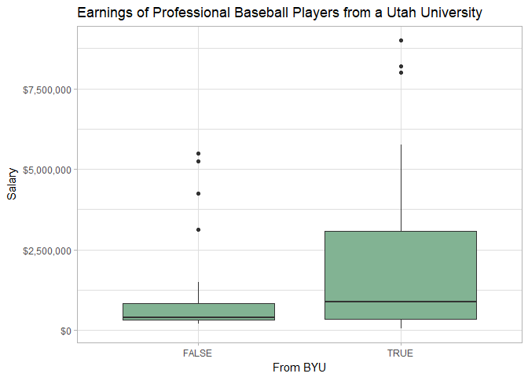

```r
Master %>% 
  inner_join(CollegePlaying, by = "playerID") %>% 
  inner_join(filter(Schools, state == "UT"), by = "schoolID") %>% 
  left_join(Salaries, by = "playerID") %>% 
  mutate(byu = schoolID == "byu") %>% 
  #mutate(adj_sal = inflation_adjust(2017, yearID)) %>% 
  ggplot(aes(byu, salary)) +
  theme_light() +
  geom_boxplot(fill = "#82b393") +
  scale_y_continuous(labels = scales::dollar) +
  labs(x = "From BYU", y = "Salary", title = "Earnings of Professional Baseball Players from a Utah University")
```

<!-- -->

