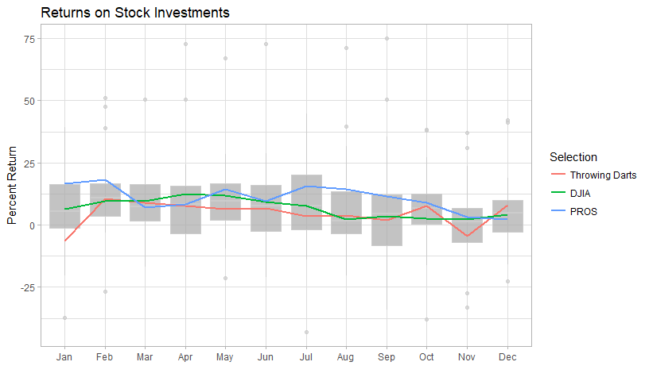

```r
month_names <- c(
  "January", "February", "March", "April", "May", "June", 
  "July", "August", "September", "October", "November", "December"
)

dart$month_end <- gsub('.{4}$', '', dart$contest_period) # remove the last 4 chars
dart$month_end <- gsub('.*\\-', '', dart$month_end) # keep only after the -
dart$month_end <- fct_recode(dart$month_end, February = "Febuary", December = "Dec.") # Fixing spelling variations

dart$month_abv <- substr(dart$month_end, 0, 3) # Take only the first 3 chars
# I do all this the hard way, but it helped me learn.
# str_split(sep = "-")
# str_sub(end = -5)
dart$month_abv <- factor(dart$month_abv, levels = month.abb) # month.abb is built into R
dart$month_end <- factor(dart$month_end, levels = month_names)
```


```r
averages <- dart %>% 
  filter(contest_period != "Average") %>% 
  group_by(variable, month_abv) %>% 
  summarise(month_avg = mean(value))
averages$variable <- fct_recode(averages$variable, 'Throwing Darts' = "DARTS")
```


```r
dart %>% 
  filter(contest_period != "Average") %>% 
  ggplot(aes(month_abv, value)) +
  theme_light() +
  geom_boxplot(alpha = 0.7, fill = "#aaaaaa", color = "#cccccc") +
  geom_line(data = averages, aes(x = month_abv, y = month_avg, color = variable, group = variable), size = 1.04) +
  labs(x = "", y = "Percent Return", color = "Selection", title = "Returns on Stock Investments")
```

<!-- -->

