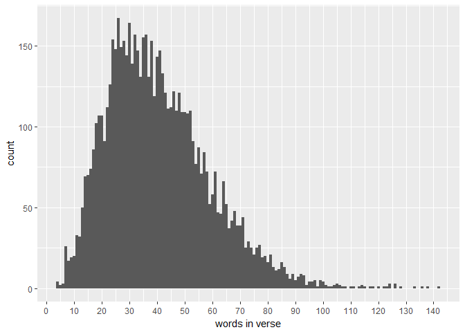

```r
length(books$scripture_text) #41995

table(books$volume_short_title)
```


```r
count_verses <- function(x, book) {
  x %>% 
  filter(volume_short_title == book) %>% 
  nrow()
}
```


```r
# average length of verses

(books %>% 
  filter(volume_short_title == "NT") %>% 
  select(scripture_text) %>% 
  unlist() %>% 
  stri_stats_latex())[["Words"]] /
count_verses(books, "NT")
```

```
## [1] 22.70517
```

```r
(books %>% 
  filter(volume_short_title == "BoM") %>% 
  select(scripture_text) %>% 
  unlist() %>% 
  stri_stats_latex())[["Words"]] /
count_verses(books, "BoM")
```

```
## [1] 40.50863
```


```r
# how many times "Jesus" appears

occur_nt <- books %>% 
  filter(volume_short_title == "NT") %>% 
  select(scripture_text) %>% 
  str_locate_all(pattern = "Jesus") %>%
  complete.cases() %>% 
  sum()

occur_bom <- books %>% 
  filter(volume_short_title == "BoM") %>% 
  select(scripture_text) %>% 
  str_locate_all(pattern = "Jesus") %>%
  complete.cases() %>% 
  sum()
```


```r
# save the number of words in each verse to a vector

verses <- (books %>% 
  filter(volume_short_title == "BoM") %>% 
  select(scripture_text))[1][[1]]

verse_lengths <- vector("integer", length = count_verses(books, "BoM"))

for (i in 1:count_verses(books, "BoM")) {
     verse_lengths[i] <- as.integer(stri_stats_latex(verses[i])[["Words"]])
}
```


```r
as.tibble(verse_lengths) %>% 
  ggplot(aes(value)) +
  geom_histogram(binwidth = 1) +
  scale_x_continuous(breaks = seq(0, 150, by = 10)) +
  labs(x = "words in verse")
```

<!-- -->

