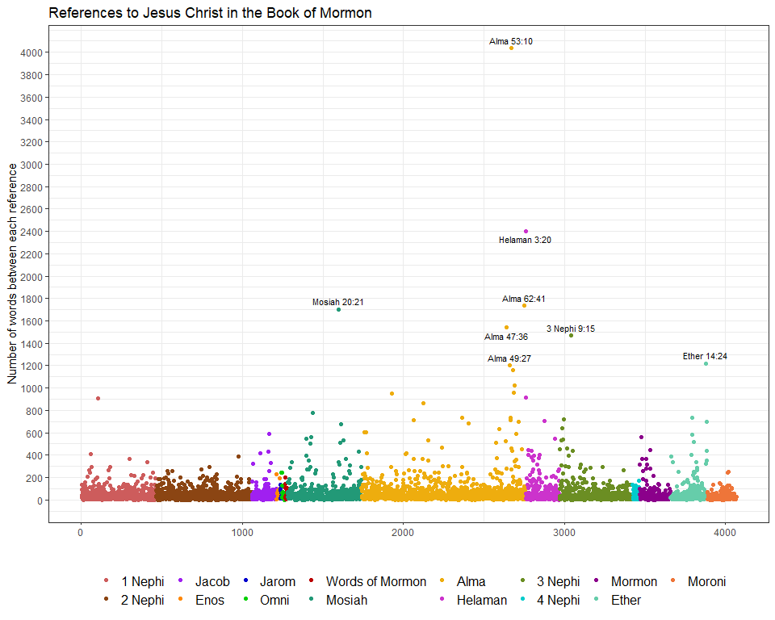
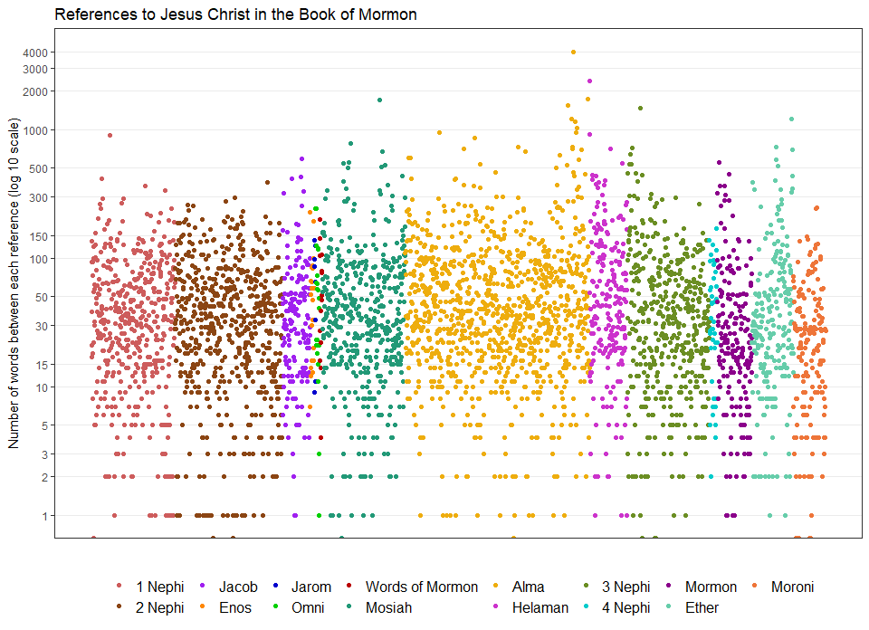
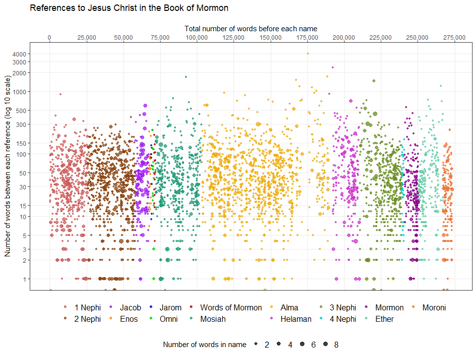
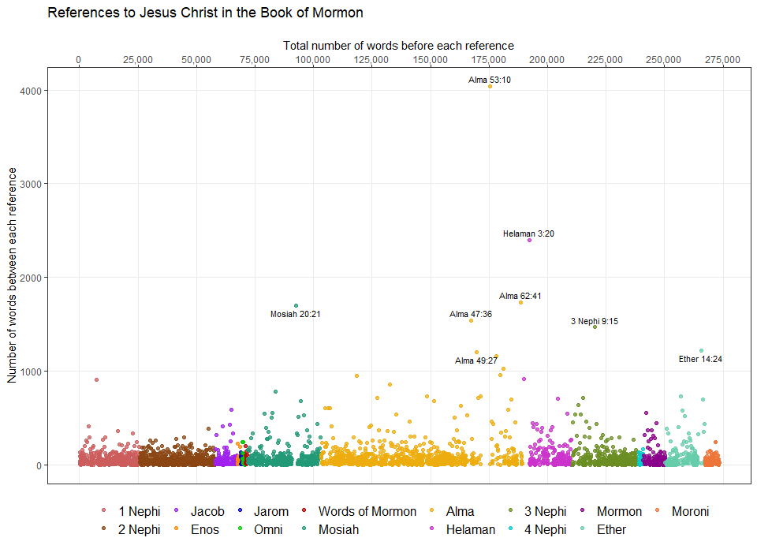
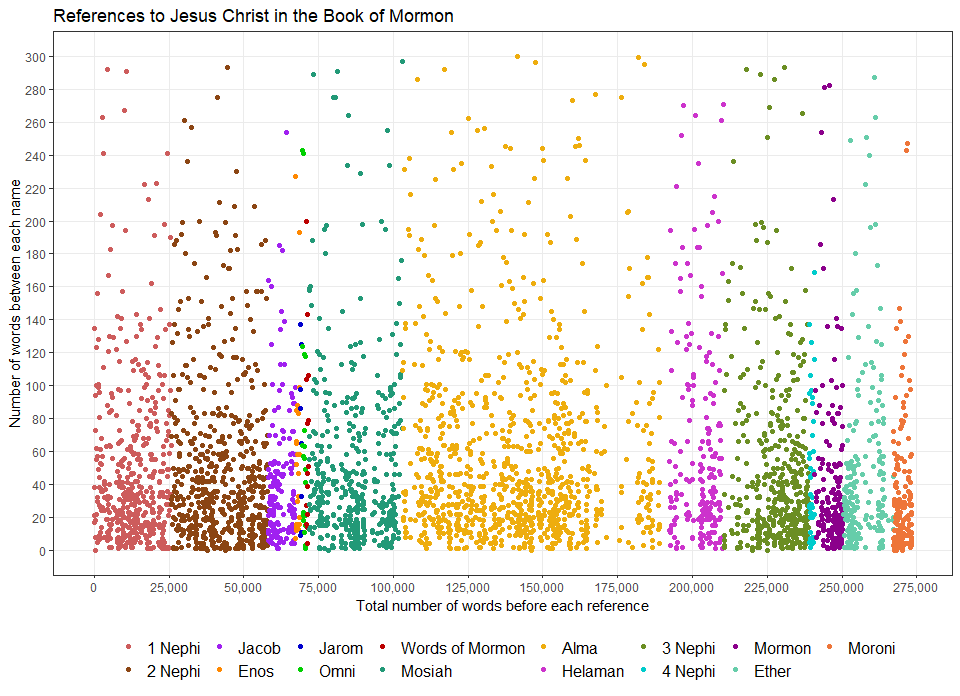

#### This second version of the case study uses text labels that aren't hard coded.

</br>

##### I downloaded the standard works and parsed the text of The Book of Mormon for uses of the names of Jesus Christ.

```r
# When running this chunk alone, this line needs to be commented out
setwd("../")

# LOAD SCRIPTURES
scriptures <- read_csv("data/lds-scriptures.csv")
bom <- scriptures %>% 
  filter(volume_short_title == "BoM")

# LOAD NAMES
names <- read_rds(gzcon(url("https://byuistats.github.io/M335/data/BoM_SaviorNames.rds")))
# Need to parse multi-word names first
names <- names %>% arrange(desc(words))
# Chosen method solve a syntax error that came up later
names_col <- names$name

# MAKE EMPTY TIBBLE
references <- tibble(name_id = character(), observation = character(), book = character(), verse = character())
end_observation <- ""

# FILL TIBBLE
for (verse in unique(bom$verse_title)) {
  scr_text <- bom %>% 
    filter(verse_title == verse)
  
  scr_text <- paste(c(end_observation, scr_text$scripture_text), collapse = " ")

  for (j in 1:length(names$name)) {
    scr_text <- str_replace_all(scr_text, names$name[j], str_c("__", j, "__"))
  }

  observations <- scr_text %>% 
    str_split("__[0-9]+__") %>% unlist()

  name_id <- scr_text %>% 
    str_match_all("__[0-9]+__") %>% unlist()

  references <- references %>% 
    bind_rows(tibble(name_id = name_id, observation = observations[1:length(observations) - 1], verse = verse, book = str_remove_all(verse, "[0123456789 :]+$")))
  
  # Gets packed onto the first observation of the next book
  end_observation <- observations[length(observations)]
}

# REMOVE "__"S
references$name_id <- references$name_id %>% 
  str_extract_all("[0-9]+") %>% unlist() %>% as.integer() 

# MAKE WORD COUNT COLUMN
spaces <- rep(0, length(references$observation))
for (k in 1:(length(spaces))) {
  spaces[k] <- stri_stats_latex(references$observation[k])[["Words"]]
}

# NAMES COLUMN
references <- references %>% 
  mutate(name = names_col[name_id], observation_id = c(1:length(spaces)), space = spaces)

# REORDER BOOK FACTORS TO FIX COLOR LEGEND
references$book <- factor(references$book, levels = unique(references$book))
```

</br>

##### The Savior is mentioned over 4000 times in the Book of Mormon. Each point in the plot below represents the group of words between each reference; they are plotted in order from left to right. The outliers are what most stand out.

```r
my_colors <- c("indianred","chocolate4","purple","#ff8800","mediumblue","#00d000","#bb0000","#229977","darkgoldenrod2","#cc33cc","olivedrab","#00cccc","darkmagenta","aquamarine3","#ee7539")

references %>% 
  ggplot(aes(x = observation_id, y = space)) +
  theme_bw() +
  geom_point(aes(color = book)) +
  geom_text_repel(data = filter(references, space > 1200), aes(label = verse), size = 3, direction = "y", force = .2) +
  scale_color_manual(values = my_colors) +
  labs(x = "", y = "Number of words between each reference", title = "References to Jesus Christ in the Book of Mormon", color = "") +
  scale_y_continuous(breaks = seq(0, 4000, by = 200)) +
  theme(legend.position = "bottom", legend.text = element_text(size = 12)) +
  guides(color = guide_legend(nrow = 2))
```

<!-- -->

</br>

##### This plot was created to get a better view of the individual observations. In this plot it is easier to notice the pattern changes between stories and authors.

```r
references %>% 
  ggplot(aes(x = observation_id, y = space, color = book)) +
  theme_bw() +
  geom_point() +
  scale_color_manual(values = my_colors) +
  labs(x = "", y = "Number of words between each reference (log 10 scale)", title = "References to Jesus Christ in the Book of Mormon", color = "") +
  scale_y_log10(breaks = c(0,1,2,3,5,10,15,30,50,100,150,300,500,1000,2000,3000,4000)) +
  theme(legend.position = "bottom", panel.grid.minor = element_blank(), legend.text = element_text(size = 12)) +
  scale_x_continuous(breaks = c()) +
  guides(color = guide_legend(nrow = 2))
```

<!-- -->


```r
references_2 <- references %>% left_join(names, by = "name")
references_2 <- references_2 %>% mutate(cumulative_words = rep(space[1], length(space)))
# references_2$space <- as.integer(references_2$space)
# references_2$cumulative_words <- as.integer(references_2$cumulative_words)

for (p in 2:length(references_2$cumulative_words)) {
  references_2$cumulative_words[p] <- (references_2$space[p] + references_2$cumulative_words[p - 1] + references_2$words[p - 1])
}
```

</br>

##### Realizing that the previous graphs are somewhat deceptive, I created this which shows the actual distance in words between each reference. I also show the length of each reference by changing the size of the points. As a result, this is much more what the Book of Mormon actually looks like, at least in terms of references to Christ.

```r
references_2 %>% 
  ggplot(aes(x = cumulative_words, y = space, color = book, size = words)) +
  theme_bw() +
  geom_point(aes(), alpha = 0.75) +
  scale_color_manual(values = my_colors) +
  labs(x = "\nTotal number of words before each name", y = "Number of words between each reference (log 10 scale)", title = "References to Jesus Christ in the Book of Mormon", color = "", size = "Number of words in name") +
  scale_y_log10(breaks = c(0,1,2,3,5,10,15,30,50,100,150,300,500,1000,2000,3000,4000)) +
  theme(legend.position = "bottom", legend.box = "vertical", panel.grid.minor = element_blank(), legend.text = element_text(size = 12)) +
  scale_x_continuous(position = "top", labels = comma, breaks = seq(0, 300000, by = 25000)) +
  guides(color = guide_legend(nrow = 2, order = 1), size = guide_legend(order = 2)) +
  scale_size_continuous(range = c(1, 3))
```

<!-- -->

</br>


```r
references_2 %>% 
  ggplot(aes(x = cumulative_words, y = space, color = book)) +
  theme_bw() +
  geom_point(aes(), alpha = 0.75) +
  geom_text_repel(data = filter(references_2, space > 1200), aes(label = verse), size = 3, direction = "y", force = .2, color = "black", alpha = 1) +
  scale_color_manual(values = my_colors) +
  labs(x = "\nTotal number of words before each reference", y = "Number of words between each reference", title = "References to Jesus Christ in the Book of Mormon", color = "") +
  theme(legend.position = "bottom", legend.box = "vertical", panel.grid.minor = element_blank(), legend.text = element_text(size = 12)) +
  scale_x_continuous(position = "top", labels = comma, breaks = seq(0, 300000, by = 25000)) +
  guides(color = guide_legend(nrow = 2, order = 1), size = guide_legend(order = 2)) +
  scale_size_continuous(range = c(1, 3))
```

<!-- -->

</br>

##### This was a prototype graphic that zooms in on the 0-300 range, instead of using a log scale. I had received a lot of feedback from students who didn't like the log scale, but those with experience in data visualization stated since that my log scale is good.

```r
references_2 %>% 
  ggplot(aes(x = cumulative_words, y = space, color = book)) + # size = (words)
  theme_bw() +
  geom_point() +
  scale_color_manual(values = my_colors) +
  labs(x = "Total number of words before each reference", y = "Number of words between each name", title = "References to Jesus Christ in the Book of Mormon", color = "", size = "Number of words in name") +
  scale_y_continuous(limits = c(0,300), breaks = seq(0, 300, by = 20)) +
  scale_x_continuous(labels = comma, breaks = seq(0, 300000, by = 25000)) +
  theme(legend.position = "bottom", panel.grid.minor = element_blank(), legend.text = element_text(size = 12)) +
  guides(color = guide_legend(nrow = 2))
```

<!-- -->


```r
names %>% 
  arrange(words) %>% 
  select(name) %>%
  kable(caption = "Here are the names that were included in the search:", row.names = 1:nrow(names))
```


Table: Here are the names that were included in the search:

      name                                                       
----  -----------------------------------------------------------
1     God                                                        
2     One                                                        
3     Son                                                        
4     Man                                                        
5     Lord                                                       
6     Lamb                                                       
7     King                                                       
8     Jesus                                                      
9     Maker                                                      
10    Being                                                      
11    Savior                                                     
12    Father                                                     
13    Christ                                                     
14    Messiah                                                    
15    Creator                                                    
16    Beloved                                                    
17    Redeemer                                                   
18    Shepherd                                                   
19    Almighty                                                   
20    Wonderful                                                  
21    Counselor                                                  
22    O God                                                      
23    Lord God                                                   
24    Holy God                                                   
25    Holy One                                                   
26    Lord God                                                   
27    Most High                                                  
28    Mighty God                                                 
29    Holy Child                                                 
30    Eternal God                                                
31    Beloved Son                                                
32    Holy Messiah                                               
33    Lord Jehovah                                               
34    Jesus Christ                                               
35    Almighty God                                               
36    Christ Jesus                                               
37    Great Spirit                                               
38    Well Beloved                                               
39    Eternal Head                                               
40    good shepherd                                              
41    Supreme Being                                              
42    Eternal Father                                             
43    Lord Omnipotent                                            
44    Supreme Creator                                            
45    heavenly Father                                            
46    Son of God                                                 
47    O Lord God                                                 
48    Lamb of God                                                
49    Lord my God                                                
50    Lord our God                                               
51    God of Isaac                                               
52    God of Jacob                                               
53    Lord his God                                               
54    Lord thy God                                               
55    his Holy One                                               
56    God of Israel                                              
57    God of nature                                              
58    Lord of Hosts                                              
59    Lord your God                                              
60    Most High God                                              
61    God of Abraham                                             
62    Lord their God                                             
63    King of heaven                                             
64    Christ the Son                                             
65    God the Father                                             
66    Alpha and Omega                                            
67    Father of heaven                                           
68    the true Messiah                                           
69    Christ, the Lord                                           
70    Lord God Almighty                                          
71    Lord thy Redeemer                                          
72    Only Begotten Son                                          
73    Lord Jesus Christ                                          
74    Lord their Redeemer                                        
75    Lord God Omnipotent                                        
76    Savior Jesus Christ                                        
77    Son of righteousness                                       
78    Son of Righteousness                                       
79    The Everlasting Father                                     
80    Lord God of Hosts                                          
81    Holy One of Jacob                                          
82    God of our fathers                                         
83    Mighty One of Jacob                                        
84    The Prince of Peace                                        
85    Mighty One of Israel                                       
86    Lord of the vineyard                                       
87    Redeemer of the world                                      
88    master of the vineyard                                     
89    Lord, the Almighty God                                     
90    God, the Eternal Father                                    
91    Eternal Father of heaven                                   
92    Jehovah, the Eternal Judge                                 
93    Christ, the Lord Omnipotent                                
94    Son of our great God                                       
95    Son of the living God                                      
96    Son of the Eternal Father                                  
97    great Mediator of all men                                  
98    the beginning and the end                                  
99    Son of the everlasting God                                 
100   Father of heaven and earth                                 
101   Only Begotten of the Father                                
102   Lord and Savior Jesus Christ                               
103   Jesus Christ, the Son of God                               
104   Our Father who art in heaven                               
105   God, the Father of all things                              
106   Lord, the Redeemer of all men                              
107   Eternal Father of heaven and earth                         
108   the Lord Jesus Christ, their Redeemer                      
109   God of Abraham, and Isaac, and Jacob                       
110   Creator of all things from the beginning                   
111   Jesus Christ, the Son of the living God                    
112   the Father of the heavens, and all things that in them are 
