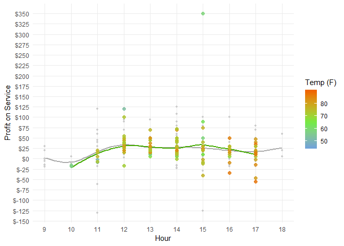
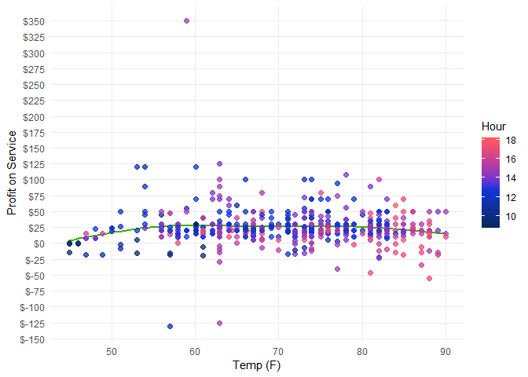

```r
# I need to adjust the time zone.

# carwash data
wash <- read_csv("https://byuistats.github.io/M335/data/carwash.csv") %>% mutate(time = with_tz(time, tz = "America/Denver")) %>% mutate(hour = ceiling_date(time, "hours")) %>% select(hour, 4)


## Weather Data: Focusing on valid and tmpf, but the folllowing may also be of interest: relh, sknt (wind,knots), p01i (precipitation), gust (http://wiki.wunderground.com/index.php/Educational_-_Wind_gusts_vs._gust_speed)
# riem_measures(station = "RXE",  date_start  = "2016-05-13",  date_end  =  "2016-07-18") %>% 
#   select(valid, tmpf, relh, sknt, p01i, gust) %>% 
#   write_csv("data/weather_RXE_S16.csv")

# setwd("../")
# setwd("../")
setwd("C:/Users/Jim/Desktop/Math 335/M335_Greene_Jim_")
s16 <- read_csv("data/weather_RXE_S16.csv") %>% mutate(valid = with_tz(valid, tz = "America/Denver"))

s16 <- s16 %>% mutate(hour = ceiling_date(valid, "hour")) %>% select(hour, tmpf, relh, sknt, p01i, gust)

# Combine tables
wash <- wash %>% left_join(s16, by = "hour")
```


```r
wash %>% ggplot(aes(tmpf, amount)) +
  geom_point() +
  geom_smooth() +
  labs(x = "Temp (F)", y = "Profit on Service") +
  scale_y_continuous(label = scales::dollar, breaks = seq(-150, 350, by = 25))
```

<!-- -->


```r
wash %>% mutate(hour = hour(hour)) %>%  ggplot(aes(hour, amount, color = tmpf)) +
  theme_minimal() +
  geom_smooth(color = "#AAAAAA", se = F) +
  geom_smooth(data = na.omit(wash), aes(hour(hour), amount), color = "#44aa00",se = F) +
  geom_point(size = 1) +
  geom_point(data = na.omit(wash), aes(hour(hour), amount, color = tmpf), size = 2, alpha = .8) +
  labs(x = "Hour", y = "Profit on Service", color = "Temp (F)") +
  scale_y_continuous(label = scales::dollar, breaks = seq(-150, 350, by = 25)) +
  scale_x_continuous(breaks = seq(0,24,1)) +
  # coord_cartesian(xlim = c(14,24)) +
  theme(panel.grid.minor = element_blank()) +
  scale_color_gradient2(low = "#5691F7", mid = "#70ec42", high = "#ef6502", midpoint = 65, na.value = "#CCCCCC")
```

<!-- -->


```r
wash %>% mutate(hour = hour(hour)) %>%  ggplot(aes(tmpf, amount, color = hour)) +
  theme_minimal() +
  geom_smooth(color = "#44aa00", se = F) +
  geom_point(size = 2, alpha = .75) +
  labs(x = "Temp (F)", y = "Profit on Service", color = "Hour") +
  scale_y_continuous(label = scales::dollar, breaks = seq(-150, 350, by = 25)) +
  #scale_x_continuous(breaks = seq(0,24,1)) +
  #coord_cartesian(xlim = c(14,24)) +
  theme(panel.grid.minor = element_blank()) +
  scale_color_gradient2(low = "#012345", mid = "#1234DF", high = "#FF5660", midpoint = 13, na.value = "#CCCCCC")
```

<!-- -->

