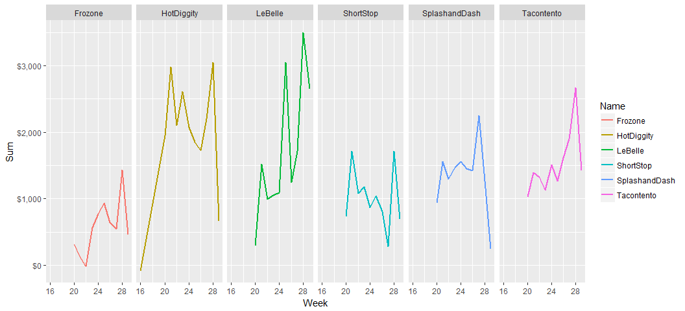
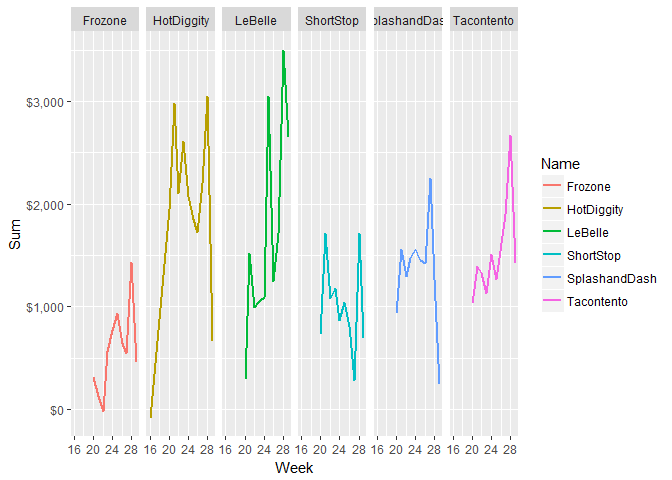
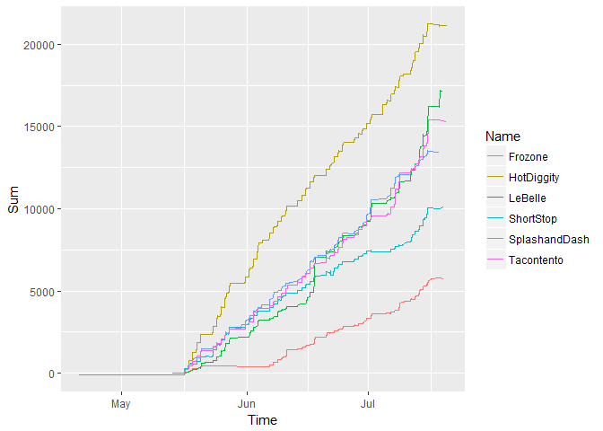

              
These are the types:

Short Stop, Food(pre-packaged), 2593

Tacontento, Food(prepared), 4333

Splash and Dash, Services, 533

Le Belle, Goods, 634

Hot Diggity, Food(prepared), 5887

Frozone, Food(pre-packaged), 1674


```r
# fix time zone
sales$Time <- with_tz(sales$Time, "America/Denver")
# Make an hour column
sales <- sales %>% mutate(Hour = hour(Time), Date = date(Time), Weekday = wday(Time), Monthday = mday(Time), Month = month(Time), Week = week(Time), Clock = (hour(Time) + minute(Time)/60)) %>% filter(Name != "Missing")
```


```r
#check and explore data

table(sales$Name)

sales %>% filter(Name == "Missing")

table(filter(sales, Name == "Tacontento")$Hour)
table(filter(sales, Name == "Frozone")$Hour)
table(filter(sales, Name == "HotDiggity")$Hour)
table(filter(sales, Name == "LeBelle")$Hour)
table(filter(sales, Name == "ShortStop")$Hour)
table(filter(sales, Name == "SplashandDash")$Hour)

sales %>% filter(Name == "Tacontento") %>% ggplot(aes(Time, Amount)) +
  geom_point()
sales %>% filter(Name == "Frozone") %>% ggplot(aes(Time, Amount)) +
  geom_point()
sales %>% filter(Name == "HotDiggity") %>% ggplot(aes(Hour, Amount)) +
  geom_point()
sales %>% filter(Name == "LeBelle") %>% ggplot(aes(Hour, Amount)) +
  geom_point()
sales %>% filter(Name == "Missing") %>% ggplot(aes(Hour, Amount)) +
  geom_point()
sales %>% filter(Name == "ShortStop") %>% ggplot(aes(Hour, Amount)) +
  geom_point()
sales %>% filter(Name == "SplashandDash") %>% ggplot(aes(Hour, Amount)) +
  geom_point()

# notice here that one charge, $194, might have been made to negate the other.
# without any notes on these transactions there is no real way to know what they are. I can only guess.
sales %>% filter(Name == "ShortStop") %>% arrange(Amount)
sales %>% filter(Name == "ShortStop") %>% arrange(desc(Amount))

table(sales$Month)
 
table(sales$Week)
```

All the businesses have unusual outliers and negative values. I have attempted some speculation, and I think that they are necessary to the final balance. Considering that and since there is no documentation on what the values mean, I chose to include all of data. I only exculed the "Missing" company name because it can not be informatively associated with any of the others.

As discussed in class, it is also possible that many transactions were not entered through the system at the the time the purchases actually occured. Just the same, many of these hours are still possible and I am mainly concerned with understanding the performance of each business so I did not cooerce those values to anything other than what has been given.

These discrepencies should be kept in mind, but a reasonanable understanding can still be obtained.

One transaction of -$87.70 occurs for Hot Diggity, April 20th. I expect that this was a preparatory expense.


```r
sales %>% 
  ggplot(aes(Clock, Name)) +
  theme_minimal() +
  geom_bin2d(bins = 14) +
  coord_cartesian(xlim = c(8, 21)) +
  scale_x_continuous(breaks = seq(8, 21, by = 1)) +
  theme(panel.grid = element_line(color = "black"), panel.grid.minor = element_blank(), panel.grid.major.y = element_blank()) +
  labs(x = "Time in hours", y = "Company", title = "Transaction Volume")
```

<!-- -->

For IBC businesses at the school, 10am-1:30pm is the peak time. There is also a little flow for some businesses from 5-8pm.


```r
#the cumsum() line graph does what this does and more
sales %>% 
  ggplot(aes(Name, weight = Amount)) +
  geom_bar() +
  scale_y_continuous(labels = scales::dollar)
```


```r
# Profits by week

# sales %>% 
#   group_by(Name, Week) %>% 
#   summarize(Sum = sum(Amount)) %>% 
#     ggplot(aes(Week, y = Sum)) +
#     geom_line(aes(group = Name, color = Name), size = 1) +
#     scale_y_continuous(labels = scales::dollar) +
#     scale_x_continuous(breaks = seq(16, 28, by = 2))

sales %>% 
  group_by(Name, Week) %>% 
  summarize(Sum = sum(Amount)) %>% 
    ggplot(aes(Week, y = Sum)) +
    geom_line(aes(color= Name),size = 1) +
    scale_y_continuous(labels = scales::dollar) +
    scale_x_continuous(breaks = seq(16, 28, by = 4)) +
    facet_wrap(~Name, nrow = 1)
```

<!-- -->


```r
# TO DO: make a cumsum line graph.
#plot(cumsum(sales$Amount))

sales %>%
  group_by(Name) %>%
  arrange(Time) %>% 
  mutate(Sum = cumsum(Amount)) %>% 
  ggplot(aes(Time, Sum)) +
  geom_line(aes(group = Name, color = Name))
```

<!-- -->

```r
# sales %>%
#   group_by(Name) %>% 
#   ggplot(aes(Week, Amount)) +
#   geom_step(aes(group = Name, color = Name)) +
#   coord_cartesian(xlim = c(19, 28)) +
#   scale_x_continuous()
```

Since Le Belle might have been a fad, I would most reccommend investing in Hot Diggity because it is so consistent and had higher profits than any of the other companies.
