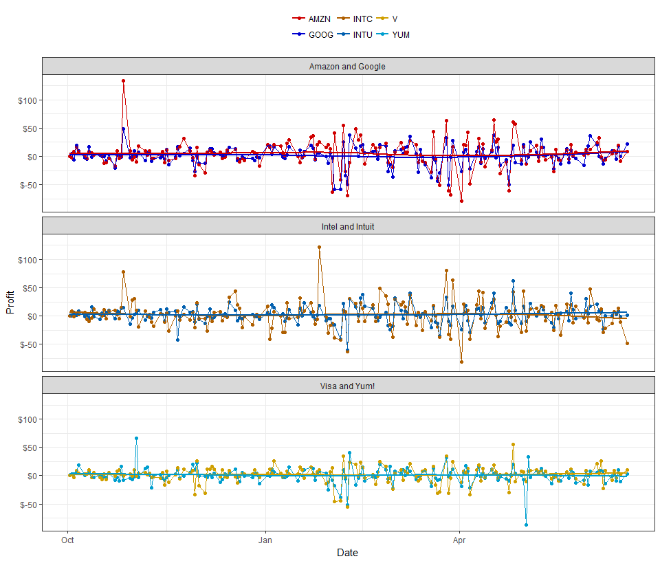
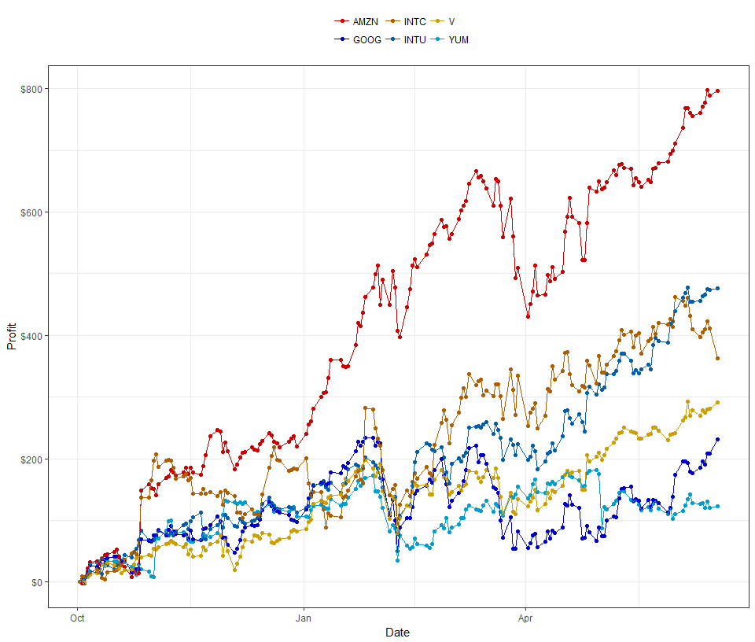

```r
yum <- tq_get("YUM", "stock.prices") %>% filter(date >= "2017-10-01")
intu <- tq_get("INTU", "stock.prices") %>% filter(date >= "2017-10-01")
goog <- tq_get("GOOG", "stock.prices") %>% filter(date >= "2017-10-01")

amzn <- tq_get("AMZN", "stock.prices") %>% filter(date >= "2017-10-01")
v <- tq_get("V", "stock.prices") %>% filter(date >= "2017-10-01")
intc <- tq_get("INTC", "stock.prices") %>% filter(date >= "2017-10-01")
```


```r
# A function that returns a vector of sequential changes of a column in a dataframe proportional to the first value
profit <- function(data, column_id)
  {
  new_vector <- c(rep(0, length(data[[column_id]])))
  for (i in 2:length(data[[column_id]])) 
    {
    new_vector[i] <- (data[[column_id]][i] - data[[column_id]][i - 1]) / data[[column_id]][1]
    }
  return(new_vector)
}

full <- yum %>% 
  mutate(name = "YUM", profit = profit(yum, 5) * 1000, group = "Visa and Yum!") %>% 
  bind_rows(intu %>% mutate(name = "INTU", profit = profit(intu, 5) * 1000, group = "Intel and Intuit")) %>%
  bind_rows(goog %>% mutate(name = "GOOG", profit = profit(goog, 5) * 1000, group = "Amazon and Google")) %>% 
  bind_rows(amzn %>% mutate(name = "AMZN", profit = profit(amzn, 5) * 1000, group = "Amazon and Google")) %>% 
  bind_rows(v %>% mutate(name = "V", profit = profit(v, 5) * 1000, group = "Visa and Yum!")) %>% 
  bind_rows(intc %>% mutate(name = "INTC", profit = profit(intc, 5) * 1000, group = "Intel and Intuit"))
```

In an imaginary scenario we invest $1000 in each of the following stocks:</br>

##### My selection
AMZN  - Amazon</br>
V     - Visa</br>
INTC  - Intel</br>

##### My friend's selection
YUM   - Yum! Brands </br>
INTU  - Intuit </br>
GOOG  - Alphabet Class C </br>
</br>

##### Results


```r
my_colors <- c("#CF0000", "#0000CF", "#AF5F00", "#005FAF", "#CF9F00", "#009FCF")

full %>% ggplot(aes(date, profit, color = name)) +
  theme_bw() +
  geom_point() +
  geom_line(aes(group = name)) +
  geom_smooth(data = filter(full, name == "GOOG"), se = F) +
  geom_smooth(data = filter(full, name == "AMZN"), se = F) +
  geom_smooth(data = filter(full, name == "INTC"), se = F) +
  geom_smooth(data = filter(full, name == "INTU"), se = F) +
  geom_smooth(data = filter(full, name == "V"), se = F) +
  geom_smooth(data = filter(full, name == "YUM"), se = F) +
  labs(y = "Profit", x = "Date", color = "") +
  scale_y_continuous(labels = scales::dollar) +
  theme(legend.position = "top", legend.direction = "horizontal") +
  scale_color_manual(values = my_colors) +
  facet_wrap( ~ group, ncol = 1)
```

<!-- -->

It's hard to tell from this who is winning overall, so I made a cumulative version.

```r
(full <- full %>% 
  group_by(name) %>% 
  mutate(cum_profit = cumsum(profit))) %>% 
  ggplot(aes(date, cum_profit, color = name)) +
  theme_bw() +
  geom_point() +
  geom_line(aes(group = name)) +
  labs(y = "Profit", x = "Date", color = "") +
  scale_y_continuous(labels = scales::dollar) +
  theme(legend.position = "top", legend.direction = "horizontal") +
  scale_color_manual(values = my_colors)
```

<!-- -->


```r
results <- full %>% 
  filter(date == today() - 1) %>% 
  select(name, cum_profit)
```

##### Totals </br>
Me:</br>
AMZN: 797.1309495 </br>
INTC: 363.2172038 </br>
V: 291.7298408 </br>
Total: 1452.0779941 </br>

Friend:</br>
GOOG: 230.9838098 </br>
INTU: 475.6596347 </br>
YUM: 122.8474305 </br>
Total: 829.490875

As we can see, I beat my imaginary friend in this game.


