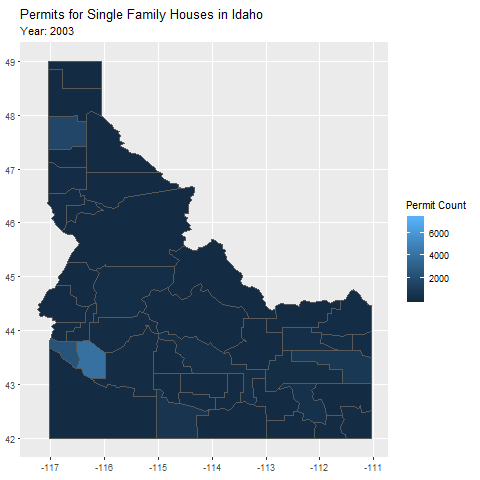
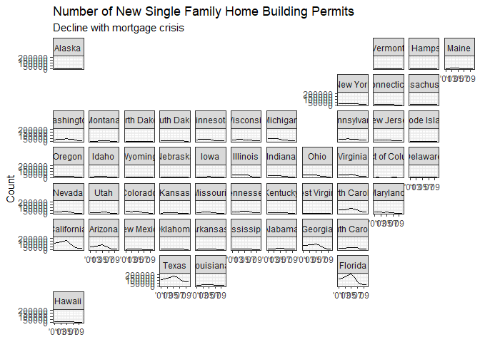

```r
idaho_permits <- permits %>% filter(StateAbbr == "ID") %>% group_by(countyname, year) %>% summarize(permit_count = sum(value))

idaho_permits_single <- permits %>% filter(StateAbbr == "ID", variable == "Single Family") %>% mutate(countyname = str_remove_all(countyname, " County"))


idaho_counties <- us_counties(states = "ID")

idaho_county_permits <- left_join(idaho_permits_single, idaho_counties, by = c("countyname" = "name"))


center_idaho <- "+proj=moll +lat_0=45 +lon_0=-114 +x_0=0 +y_0=0 +ellps=WGS84 +datum=WGS84 +units=m +no_defs"

state_permits <- permits %>% filter(variable == "Single Family") %>% group_by(StateAbbr, year) %>% summarize(permit_count = sum(value)) %>% 
  left_join(us_states(), by = c("StateAbbr" = "stusps"))
```


```r
ggplot() +
  geom_sf(data = filter(idaho_county_permits, year %in% c(2003:2009)), aes(fill = value)) +
  labs(title = "Permits for Single Family Houses in Idaho", subtitle = 'Year: {frame_time}', fill = "Permit Count") +
  transition_time(year) +
  ease_aes('linear')
```

<!-- -->
In this graph I used gganimate for the first time. It shows the possible effects of the recession according to each county.
Although the activity was worthwhile, it doesn't show the data in a very clear way. It would be better to see a chart of individual counties.


```r
state_permits %>% 
  filter(year %in% c(2001:2010)) %>% 
  ggplot(aes(x = year, y = permit_count)) +
    geom_line() +
    scale_x_continuous(breaks = seq(2001, 2009, by = 2), labels = c('\'01', '\'03', '\'05', '\'07', '\'09')) +
    theme_bw() +
    labs(title = "Number of New Single Family Home Building Permits", subtitle = "Decline with mortgage crisis", y = "Count") +
    theme(axis.title.x = element_blank()) +
    facet_geo(~ StateAbbr, grid = "us_state_grid2", label = "name")
```

<!-- -->
This plot is okay, but I would adjust the values to be in respect to population or figure out how to release the y scales by state. As it stands, it is easy to see the decline in the faster growing states: Florida, California, Texas. There was a steady incline before the recession hit.
