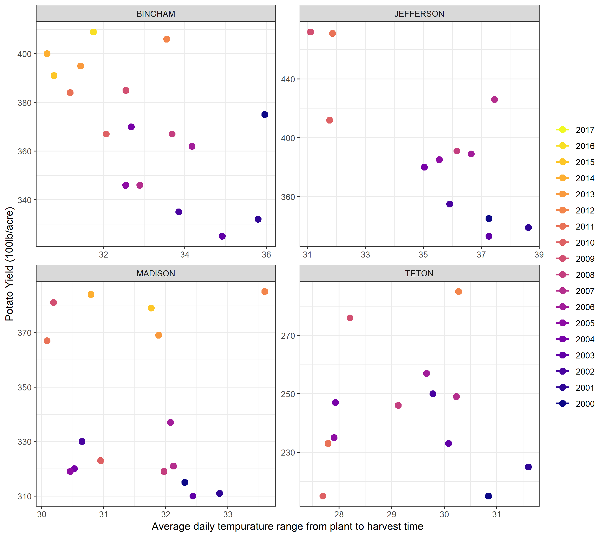

```{r setup, include=FALSE}
knitr::opts_chunk$set(echo = F, warning = F, mesage = F)

library(tidyverse)
library(lubridate)
library(plotly)
Weather <- read_csv("C:/Users/Jim/Desktop/Math 335/M335_Greene_Jim_/Case_Study_13/Weather/NOAA/Teton.csv") %>% mutate(County = "TETON") %>%
  bind_rows(read_csv("C:/Users/Jim/Desktop/Math 335/M335_Greene_Jim_/Case_Study_13/Weather/NOAA/Bingham.csv") %>% mutate(County = "BINGHAM")) %>% 
  bind_rows(read_csv("C:/Users/Jim/Desktop/Math 335/M335_Greene_Jim_/Case_Study_13/Weather/NOAA/Jefferson.csv") %>% mutate(County = "JEFFERSON")) %>% 
  bind_rows(read_csv("C:/Users/Jim/Desktop/Math 335/M335_Greene_Jim_/Case_Study_13/Weather/NOAA/Madison.csv", col_types = cols(
    SNOW = col_double(), SNWD = col_integer(), TOBS = col_integer())) %>% mutate(County = "MADISON")) %>% 
  mutate(DATE = mdy(DATE)) %>% 
  mutate(Year = year(DATE), Day = yday(DATE)) %>% 
  filter(Year != 2018)

Potato <- read_csv("C:/Users/Jim/Desktop/Math 335/M335_Greene_Jim_/Case_Study_13/Weather/potato.csv") %>% filter(County %in% c("BINGHAM", "JEFFERSON", "MADISON", "TETON"))
```

I joined the Math 488 team invested on building a model to help farmers predict their crop yields based on the weather.
After starting their project Wunderground changed their policies and would no longer issue free API keys. They could only use the two keys they had once a day.
They showed me the code they were using to pull the data and I saved it, but then decided I didn't want to hold the data on my computer. After waiting to receive the data they would often find that is was incomplete or did not go back far enough. I had started searching for other sources of weather data and found that [NOAA](https://www.ncdc.noaa.gov/cdo-web/datasets) provided a lot of data for free. It was quick to download, and more complete than the stations attempted on Wunderground. In the end, all the weather data they used came from NOAA. Andrew and the others analyzed the patterns and created dozens of graphics. Their final presentation is included in this folder.


Having heard that hot days and cold nights are good for growing potatoes, the team was curious if they would be able to observe that relationship. They also assumed that there could be other trends that I could build a graphic to look for. So I engineered and created the plot below.

The plot did not turn out to be super insightful, but it did help me learn how to show different variables on the same plot.

This is a picture of me discussing the design with the group.


Because the temperature range was one of the things we were interested in I've created a plot to show that.

Bingham and Jefferson are the only counties that appear to have a trend, but it is probably due to the later years which provided higher yields. If I find a way to isolate the effect of tempurature range from that of other variables I might be able to see something.

This plot is the same, but with precipitation.

Again, the year is the most obvious factor.


```{r, fig.width = 10, fig.height = 6}
Weather %>% 
  filter(Day < 275, Day > 112) %>% # , County == "BINGHAM"
  mutate(TDIFF = TMAX - TMIN) %>% 
  group_by(Year, County) %>% 
  summarize(avgDIFF = mean(TDIFF, na.rm = T), avgPRCP = mean(PRCP, na.rm = T)) %>% 
  left_join(Potato, by = c("Year", "County")) %>% 
  plot_ly(x = ~avgPRCP, y = ~avgDIFF, z = ~Value) %>% 
  add_markers(color = ~Year, symbol = ~County)
```